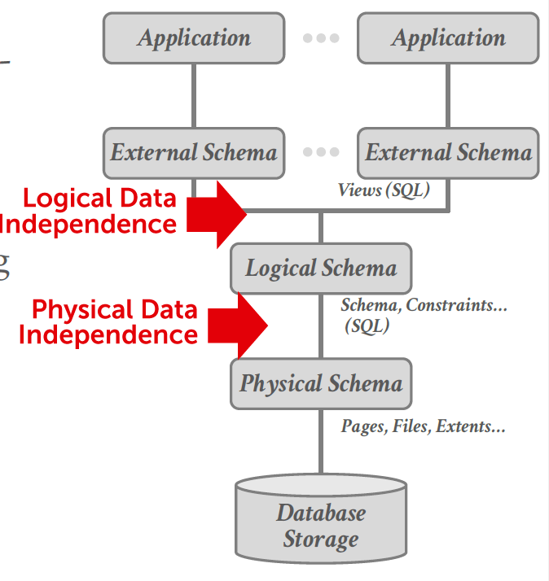
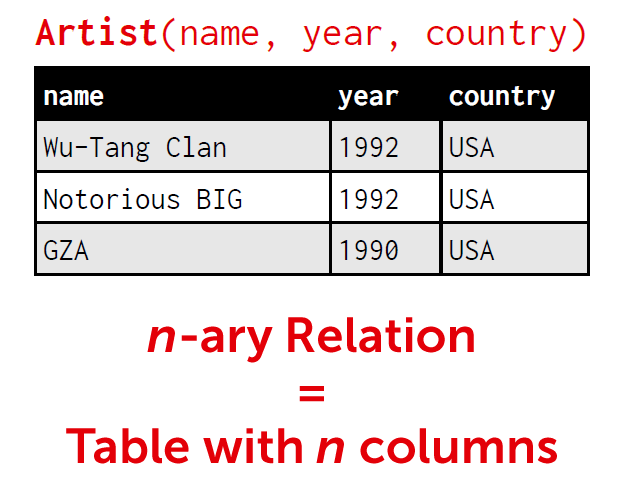
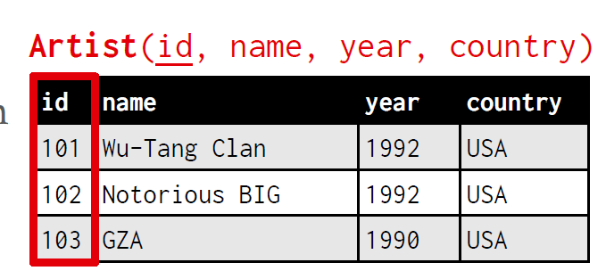
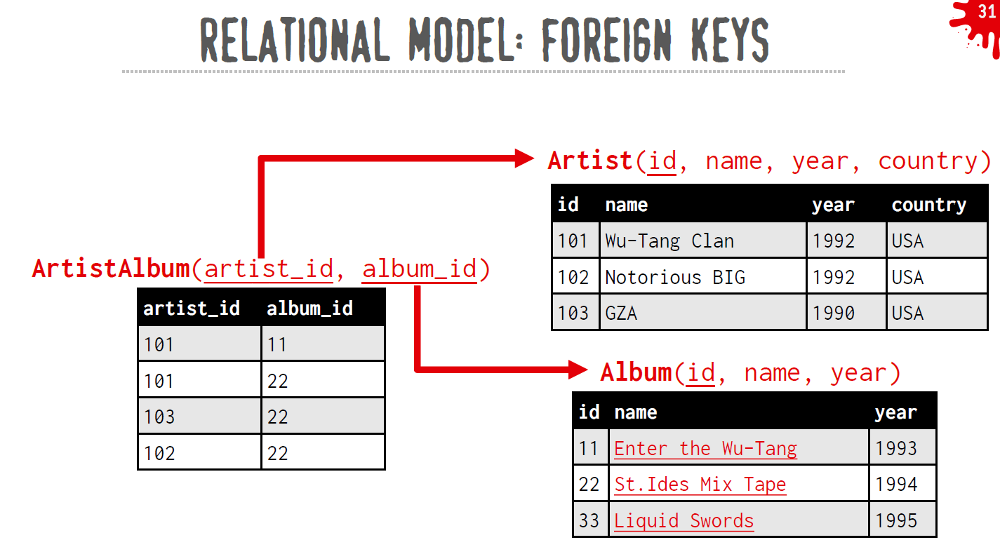
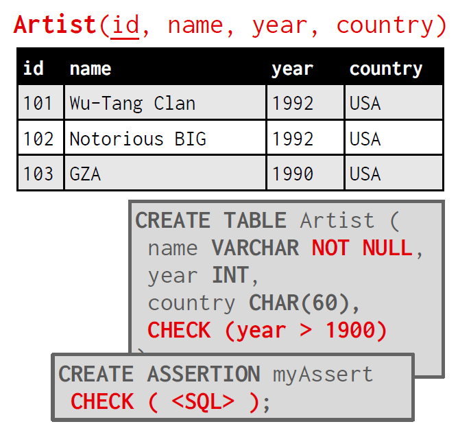

# Lecture #01: Relational Model & Algebra

15-445/645 Database Systems (Fall 2025) https://15445.courses.cs.cmu.edu/fall2025/ Carnegie Mellon University Andy Pavlo 

## 1 Databases

A database is an organized collection of inter-related data that models some aspect of the real-world (e.g modeling the students in a class or a digital music store). Databases are the core component of most computer applications. Computer Science is essentially taking in some input, performing some operations, and then producing the output, which can be seen as a database on a high level as well. 

People often confuse “databases” with “database management systems” (e.g. MySQL, Oracle, MongoDB, Snowflake). A database management system (DBMS) is the software that manages a database. Among many things, a DBMS is responsible for inserting, deleting, and retrieving data from a database. 

## 2 Flat File Strawman

Consider that we want to store data for a music store like Spotify. We want to hold information about the artists and which albums those artists have released. This database has two entities: an Artists entity and an Albums entity. 

We choose to store the database’s records as comma-separated value (csv) files that the DBMS manages, and each entity is stored in its own file (an artists.csv and albums.csv). 

In this example, artists each have a name, year, and country atribute. Albums have name, artist, and year atributes. 

The following is an example CSV file for information about artists with the schema (name, year, country): 

```txt
"Wu-Tang Clan", 1992, "USA" "Notorious BIG", 1992, "USA" "GZA", 1990, "USA" 
```

The application has to parse these files each time it wants to read or update any records. As an example, if we want to get the year that GZA went solo, we will need some program like the following to open the file, read it, and then parse each line to check for a match in the artist name. 

```python
for line in file.readlines():
    record = parse(line)
    if record[0] == "GZA" :
    print(int(record[1])) 
```

### Issues with Flat Files

There are several problems with using flat files as our database. Here are some questions to consider: 

• **Data Integrity** How do we ensure that the artist is the same for each album entry? What if somebody overwrites the album year with an invalid string? What if there are multiple artists on an album? What happens if we delete an artist that has albums? 

• **Implementation** How do you find a particular record? What if we now want to create a new application that uses the same database? What if that application is running on a diferent machine? What if two threads try to write to the same file at the same time? 

• **Durability** What if the machine crashes while our program is updating a record? What if we want to replicate the database on multiple machines for high availability? Some database systems will sacrifice safety and durability by default to make database operations appear faster. 

## 3 Database Management System

A **DBMS** is software that allows applications to store and analyze information in a database. 

A general-purpose DBMS is designed to allow the definition, creation, querying, update, and administration of databases in accordance with some data model. 

A **data model** is a collection of concepts for describing the data in database. Some examples include: 

• Relational (most common) 

• NoSQL (key/value, document, graph) 

• Array / Matrix / Vector (for machine learning) 

A **schema** is a description of a particular collection of data using a given data model. This defines the structure of data for a data model. Otherwise, you have random bits with no meaning. 

### Common Data Models

• Relational (Most DBMSs) 

• Key/Value (Simple Apps/Caching) 

• Graph (NoSQL) 

• Document/XML/Object (NoSQL) 

• Wide-Column/Column-family (NoSQL) 

• Array / Matrix / Vector (Machine Learning/Science) 

• Hierarchical (Obsolete/Legacy/Rare) 

• Network (Obsolete/Legacy/Rare) 

• Multi-Value (Obsolete/Legacy/Rare) 

### Early DBMSs

In the late 1960s, early DBMSs required developers to write queries using procedural code (e.g. IDS, IMS, CODASYL). The developers had to choose access paths and execution ordering based on the current database contents. So, if the data changes, then the developer must rewrite the query code. 

And writing queries looks like manually coding loops to traverse data structures (e.g., a nested loop over artists and albums to find matches). You must explicitly tell the system how to navigate the data such as the order of traversal. Certain assumptions about the database (e.g. data size) may hold today but can change over time. Since the execution plan is hard-coded, queries can become ineficient or even invalid as the data grows or changes. 

## 4 Relational Model

**Ted Codd** at IBM Research in the late 1960s noticed that people were rewriting DBMSs every time they wanted to change the physical layer. In 1969, he proposed the relational model as a potential solution to this. 

### The relational data model
**The relational data model** defines three concepts: 

• **Structure**: The definition of relations and their contents ==independent== of their physical representation. Each relation has a set of atributes. Each atribute has a domain of values. 

• **Integrity**: Ensure the database’s contents satisfy certain constraints. An example of a constraint would be that the age of a person cannot be a negative number. 

• **Manipulation**: Declarative API for accessing and modifying a database’s contents via relations(sets). Programmers only specify the desired result; the database system will decide the most eficient query plan to execute. 

### DATA INDEPENDENCE

The relational model provides  ==data independence== that isolates the user/application from low-level data representation. 
The user only worries about high-level application logic. DBMS optimizes the layout according to operating environment, database contents, and workload. And it will re-optimize if/when these factors change. So the change in the physical data will not break the applications. 


Isolate the user/application from lowlevel data representation.
→ The user only worries about high-level application logic.

DBMS optimizes the layout according to operating environment, database contents, and workload.
→ Re-optimize if/when these factors changes.




A **relation** is an unordered set that contains the relationship of atributes that represent entities. Since the relationships are unordered, the DBMS can store them in any way it wants, allowing for optimization. It is possible to have repeated / duplicated elements in a relation as long as their ==primary key== is diferent. 

A **tuple** is a set of atribute values (also known as its domain) in the relation. In the past, values had to be atomic or scalar, but now values can also be lists or nested data structures. Every atribute can be a special value, NULL, which means for a given tuple the atribute is undefined. 

A relation with n atributes is called an ==n-ary relation==. We will interchangeably use relation and table in this course. An n-ary relation is equivalent to a table with n columns. 




### Primary key
A relation’s **primary key** uniquely identifies a single tuple in a table. 
Some DBMSs automatically create an internal primary key if you do not define one. 
It can auto-generate unique primary keys via an **identity column**. 
→ IDENTITY (SQL Standard)
→ SEQUENCE (PostgreSQL / Oracle)
→ AUTO_INCREMENT (MySQL)



### Foreign key
A **foreign key** specifies that an atribute from one relation maps to a tuple in another relation. 
Generally, the foreign key will point / be equal to a primary key in another table. 



### Constraint
A **constraint** is a user-defined condition that must hold for any instance of the database. 
→ Can validate data within a single tuple or across entire relation(s).
→ DBMS prevents modifications that violate any constraint


Unique key and referential (foreign key) constraints are the most common. 
Another common example of constraint would be to prohibit a column from having NULL values. 

SQL:92 supports global asserts but these are rarely used (too slow).




## 5 Data Manipulation Languages (DMLs)

DMLs refer to the API that a DBMS exposes to applications to store and retrieve information from a database. There are two classes of languages for Manipulating a database: 

###  **Procedural**: 

The query specifies the (high-level) execution strategy the DBMS should use to find the desired result based on sets / bags. For example, use a for loop to scan all records and count how many records are there to retrieve the number of records in the table. 

### **Non-Procedural (Declarative)**: 
The query specifies only what data is wanted and not how to find it. For example, we can use SQL SELECT COUNT(*) FROM artist to count how many records are there in the table. 

## 6 Relational Algebra

**Relational Algebra** is a set of fundamental operations to retrieve and manipulate tuples in a relation. Each operator takes in one or more relations as inputs, and outputs a new relation. To write queries we can ”chain” these operators together. 

### Select

Select takes in a relation and outputs a subset of the tuples from that relation that satisfy a selection predicate. The predicate acts as a filter, and we can combine multiple predicates using conjunctions and disjunctions. 

Syntax: $\sigma _ { \mathrm { p r e d i c a t e } } ( R )$ 

Example: $\sigma _ { \mathrm { a . i d } = ^ { \cdot } \mathrm { a } 2 ^ { \cdot } } ( R )$ 

SQL: SELECT * FROM R WHERE $\mathsf { a } _ { - } \mathrm { i } \mathsf { d } \ = \   'a2'$ 

### Projection

Projection takes in a relation and outputs a relation with tuples that contain only specified atributes. 
→ Rearrange attributes’ ordering.
→ Remove unwanted attributes.
→ Manipulate values to create derived attributes.

You can rearrange the ordering of the atributes in the input relation as well as manipulate the values. 

Syntax: $\pi _ { \mathrm { A 1 , A 2 , . . . , A n } } ( R )$ 

Example: $\pi _ { \mathrm { b . i d - 1 0 0 , a . i d } } ( \sigma _ { \mathrm { a . i d = } \mathrm { a } 2 } , ( R ) )$ 

SQL: SELECT b_id-100, a_id FROM R WHERE a_id = 'a2' 

### Union

Union takes in two relations and outputs a relation that contains all tuples that appear in at least one of the input relations. 
Note: The two input relations have to have the exact same atributes. 

Syntax: (R ∪ S). 

SQL: (SELECT * FROM R) UNION ALL (SELECT * FROM S) 

### Intersection

Intersection takes in two relations and outputs a relation that contains all tuples that appear in both of the input relations. 
Note: The two input relations have to have the exact same atributes. 

Syntax: (R ∩ S). 

SQL: (SELECT * FROM R) INTERSECT (SELECT * FROM S) 

### Difference

Difference takes in two relations and outputs a relation that contains all tuples that appear in the first relation but not the second relation. 
Note: The two input relations have to have the exact same atributes. 

Syntax: (R − S). 

SQL: (SELECT * FROM R) EXCEPT (SELECT * FROM S) 

### Product

Product takes in two relations and outputs a relation that contains all possible combinations for tuples from the input relations. 

Syntax: (R × S). 

SQL: (SELECT * FROM R) CROSS JOIN (SELECT * FROM S), or simply SELECT * FROM R, S 

### Join

Join takes in two relations and outputs a relation that contains all the tuples that are a combination of two tuples where for each atribute that the two relations share, the values for that atribute of both tuples is the same. 

Syntax: (R ▷◁ S). 

SQL: SELECT * FROM R JOIN S USING (ATTRIBUTE1, ATTRIBUTE2...) 

### Observation

**Relational algebra** defines the fundamental operations to retrieve and manipulate tuples in a relation. It also defines an ordering of the high-level steps to compute a query. 

For example, σ<sub>b id=102</sub>(R ▷◁ S) 
represents joining R and S and then selecting / filtering the result. However, (R ▷◁ (σ (S))) will do the selection on S first, and then join the result of the selection with R. 

These two statements will always produce the same answer. However, if S has 1 billion tuples and there is only 1 tuple in S with b id=102, then (R ▷◁ (σ<sub>b id=102</sub>(S))) will be significantly faster than σ<sub>b id=102</sub>(R ▷◁ S). 

How would you know this if you were using Pandas or another procedural DML? 

A beter approach is to state the high-level result you want (retrieve the joined tuples from R and S where b<sub>id</sub> equals 102), and let the DBMS decide the steps it should take to compute the query. 

In SQL (a declarative language) we only express what we want to be computed and we do not specify how to compute the result. The DBMS is responsible for finding the best strategy to execute the query (through Query Optimization). This powerful abstraction has made SQL the de facto standard for writing queries on a relational DBMS since the user of the DBMS does not need to know anything about the internals and can query the database in the most eficient way. 


### Quries
The relational model is independent of any query language implementation.
SQL is the de facto standard (many dialects).


## 7 Other Data Models

### Document Data Model

The document data model is a collection of record documents containing a hierarchy of named field/value pairs. 
- A field’s value can be either a scalar type, an array of values, or a pointer to another document. 
- Modern implementations use JSON. Older systems use XML or custom object representations. 

Avoid object-relational impedance mismatch by tightly coupling objects and database.


The Document Model has some use cases but still runs into many of the problems discussed in the flat flie strawman example. 

### Vector Data Model

The vector data model represents one-dimensional arrays used for nearest-neighbor search (exact or approximate). 
- Vector databases are generally used for semantic search on embeddings generated by ML-trained transformer models (think ChatGPT), and
- native integration with modern ML tools and APIs (e.g., LangChain, OpenAI). At their core, these systems use specialized indexes to perform NN searches quickly. 

Recently, many relational DBMSs have shipped vector index features or extensions (pgvector) that allow NN search within the relational model. 


The vector model is not a substantial deviation from existing models that requires new DBMS architectures.
→ Every major DBMS now provides native vector index support.

Vector DBMSs offer better integration with AI tooling ecosystem (e.g., OpenAI, LangChain).


# QA: 

## Q1: what are the relations and difference between relational algebra and SQL ?

This is one of the most fundamental concepts in database systems. In fact, you can think of the relationship as:

> **Relational Algebra is the mathematical foundation.**
>
> **SQL is the practical language built on top of it.**

A good analogy is:

| Mathematics        | Programming                      |
| ------------------ | -------------------------------- |
| Boolean Algebra    | C `if` statements                |
| Lambda Calculus    | Functional programming languages |
| Relational Algebra | SQL                              |

Relational algebra defines **what operations are possible** on relations (tables). SQL provides a **user-friendly language** that expresses those operations and many more.

---

### Historical Background

Around 1970, Edgar F. Codd proposed the **Relational Model**.

His model consisted of three parts:

1. Structure
2. Integrity
3. Manipulation

The manipulation language was **Relational Algebra**.

Notice that SQL did **not** exist yet.

Several years later IBM developed **SEQUEL**, which eventually became SQL.

Therefore,

```
Relational Model
      │
      ├── Relations
      ├── Constraints
      └── Relational Algebra
              │
              ▼
          SQL Language
```

SQL inherited most ideas from relational algebra.

---

### Relational Algebra

Relational algebra is a **formal mathematical language**.

It consists of operators.

Each operator

```
Relation(s)
      │
      ▼
 Operator
      │
      ▼
 New Relation
```

Every operation takes one or more relations and returns another relation.

This property is called **closure**.

Example

```
Employee

id  name  salary
---------------
1   Tom   5000
2   Alice 7000
```

Selection

```
σ salary > 6000 (Employee)
```

Result

```
id  name  salary
---------------
2   Alice 7000
```

---

### SQL

SQL is a **declarative programming language**.

Instead of describing algorithms, you describe the desired result.

Example

```sql
SELECT *
FROM Employee
WHERE salary > 6000;
```

The DBMS internally converts this SQL into relational algebra.

---

### SQL Compilation Pipeline

A modern DBMS executes something like

```
SQL
 │
 ▼
Parser
 │
 ▼
AST
 │
 ▼
Binder
 │
 ▼
Logical Plan
 │
 ▼
Relational Algebra Tree
 │
 ▼
Optimizer
 │
 ▼
Optimized Algebra Tree
 │
 ▼
Physical Plan
 │
 ▼
Execution Engine
```

This pipeline is why relational algebra is so important—it is the optimizer's internal language.

---

### SQL is Translated into Relational Algebra

Consider

```sql
SELECT name
FROM Employee
WHERE salary > 6000;
```

Relational algebra:

```
πname
(
    σsalary>6000(Employee)
)
```

The optimizer now reasons about this tree.

---

Another example

```sql
SELECT e.name
FROM Employee e
JOIN Department d
ON e.dept_id = d.id
WHERE d.name='Engineering';
```

Logical algebra

```
πe.name
      │
σd.name='Engineering'
      │
 Employee ⋈ Department
```

The optimizer may rewrite it into

```
πe.name
      │
Employee
      ⋈
σname='Engineering'
      │
Department
```

Both produce identical results.

The second is much faster if only one department is named "Engineering."

This rewrite is called **predicate pushdown**.

---

### Mapping Between Relational Algebra and SQL

| Relational Algebra    | SQL                                                   |
| --------------------- | ----------------------------------------------------- |
| Selection (σ)         | `WHERE`                                               |
| Projection (π)        | `SELECT column...`                                    |
| Cartesian Product (×) | `CROSS JOIN`                                          |
| Join (⋈)              | `JOIN`                                                |
| Union (∪)             | `UNION` / `UNION ALL`                                 |
| Difference (−)        | `EXCEPT`                                              |
| Intersection (∩)      | `INTERSECT`                                           |
| Rename (ρ)            | `AS`                                                  |
| Sorting               | `ORDER BY` (not part of classical relational algebra) |
| Grouping              | `GROUP BY` (extended relational algebra)              |

---

### Why Doesn't SQL Look Like Relational Algebra?

Relational algebra is designed for **formal reasoning**.

SQL is designed for **human usability**.

For example

Relational algebra

```
πname
(
 σsalary>6000(Employee)
)
```

SQL

```sql
SELECT name
FROM Employee
WHERE salary > 6000;
```

SQL is much easier for programmers to write.

---

### SQL is More Powerful Than Classical Relational Algebra

Classical relational algebra is intentionally minimal.

SQL includes many additional capabilities:

| Feature           | Relational Algebra | SQL |
| ----------------- | ------------------ | --- |
| Aggregation       | ✗                  | ✓   |
| GROUP BY          | ✗                  | ✓   |
| HAVING            | ✗                  | ✓   |
| ORDER BY          | ✗                  | ✓   |
| LIMIT             | ✗                  | ✓   |
| Window Functions  | ✗                  | ✓   |
| Recursive Queries | ✗                  | ✓   |
| INSERT            | ✗                  | ✓   |
| UPDATE            | ✗                  | ✓   |
| DELETE            | ✗                  | ✓   |
| Views             | ✗                  | ✓   |
| Transactions      | ✗                  | ✓   |

Modern database textbooks therefore define **extended relational algebra**, which adds grouping, aggregation, sorting, duplicate elimination, and outer joins to more closely match SQL.

---

### Important Differences

#### 1. Set vs. Bag Semantics

##### Relational Algebra

Relations are **sets**.

Duplicates are not allowed.

```
A

1
1
2
```

becomes

```
1
2
```

---

##### SQL

SQL uses **bags (multisets)** by default.

```sql
SELECT dept_id
FROM Employee;
```

may return

```
10
10
10
20
20
```

Duplicates remain unless you request

```sql
SELECT DISTINCT dept_id
FROM Employee;
```

---

#### 2. NULL Values

Classical relational algebra assumes every attribute has a value.

SQL introduces `NULL`, which requires three-valued logic:

* TRUE
* FALSE
* UNKNOWN

For example,

```sql
salary > 5000
```

evaluated on `salary = NULL` yields **UNKNOWN**, not `FALSE`. This affects filtering, joins, and aggregates.

---

#### 3. Ordering

Relations in relational algebra are **unordered**.

SQL tables are also conceptually unordered, but SQL allows explicit ordering:

```sql
ORDER BY salary DESC;
```

Sorting is therefore considered an extension rather than a core relational operation.

---

#### 4. Updates

Relational algebra describes **queries**—transformations from relations to relations.

SQL also supports data modification:

```sql
INSERT ...
UPDATE ...
DELETE ...
MERGE ...
```

---

### How a Database Uses Both

```
                User
                  │
                  ▼
          SQL Query
                  │
          SQL Parser
                  │
                  ▼
      Relational Algebra Tree
                  │
         Query Optimizer
                  │
      Rewrite Algebra Tree
                  │
      Physical Operators
                  │
          Execution Engine
                  │
                  ▼
             Result Set
```

The key point is that **the optimizer does not optimize SQL text directly**. It optimizes an internal representation that is essentially relational algebra.

---

### Why Database Engineers Study Relational Algebra

If you're learning database internals (e.g., CMU 15-445, BusTub, PostgreSQL, DuckDB), relational algebra is indispensable because it underpins:

* **Query optimizers**, which rewrite algebra trees using equivalence rules.
* **Logical query plans**, where each node corresponds to an algebra operator.
* **Cost-based optimization**, which explores different algebra trees to minimize estimated execution cost.
* **Execution engines**, which implement physical operators (e.g., Hash Join, Index Scan) that realize the logical algebra.

Understanding relational algebra lets you see **why** a database chooses a particular execution strategy, rather than treating SQL as a black box.


## Q2:  Why you said SQL is a declarative programming language? what does  declarative programming language mean?


This is an excellent question. In fact, understanding **what "declarative" means** is one of the biggest conceptual shifts in computer science.

The short answer is:

> A **declarative programming language** describes **what** result you want.
>
> An **imperative (procedural) programming language** describes **how** to obtain that result.

This distinction is exactly why SQL became so successful.

---

### Imperative vs Declarative

Suppose you ask someone:

> "Go buy me a coffee."

There are two ways to give the instructions.

#### Imperative (How)

You tell the person every step.

```text
1. Walk to the elevator.
2. Go downstairs.
3. Exit the building.
4. Turn left.
5. Walk 200 meters.
6. Enter Starbucks.
7. Wait in line.
8. Order a latte.
9. Pay.
10. Return.
```

You specified **every action**.

---

#### Declarative (What)

Instead you simply say

```text
Bring me a latte.
```

You don't care

* which elevator
* which road
* which cashier
* which payment method

The other person decides.

This is declarative.

---

### Programming Example

Suppose we want to compute the total salary.

#### C (Imperative)

```c
int total = 0;

for (int i = 0; i < n; i++) {
    total += employees[i].salary;
}

printf("%d\n", total);
```

Notice that you specified

* iteration
* loop variable
* memory access
* addition order
* algorithm

The compiler does **exactly** what you told it.

---

#### SQL (Declarative)

```sql
SELECT SUM(salary)
FROM Employee;
```

That's all.

You never said

* use a loop
* use an index
* use parallel execution
* use SIMD
* use multiple threads

The database decides.

---

### Another Example

Suppose we want employees whose salary is over 5000.

#### C

```c
for (...) {
    if (employee.salary > 5000)
        print(employee.name);
}
```

Again you specify

* how to iterate
* where to store variables
* every conditional

---

#### SQL

```sql
SELECT name
FROM Employee
WHERE salary > 5000;
```

You only specify

> "Give me these rows."

Nothing more.

---

### Why Is SQL Declarative?

Imagine a table with one billion rows.

```text
Employee
-----------------------
1 billion tuples
```

You write

```sql
SELECT *
FROM Employee
WHERE id = 100;
```

How should the database execute this?

There are many possibilities.

##### Plan A

Sequential Scan

```text
Row1
Row2
Row3
...
Row1,000,000,000
```

---

##### Plan B

Use a B+ Tree

```text
Root
 │
 ▼
Internal
 │
 ▼
Leaf
 │
 ▼
Tuple
```

---

##### Plan C

Use a Hash Index

```text
Hash(id)
    │
    ▼
Bucket
    │
    ▼
Tuple
```

---

##### Plan D

Use Multiple CPUs

```text
CPU1
CPU2
CPU3
CPU4
```

---

##### Plan E

Read from SSD asynchronously.

---

##### Plan F

Use a covering index without touching the table.

---

**Every one of these plans produces exactly the same result.**

The only difference is performance.

Since you didn't specify **how**, the optimizer is free to choose the best plan.

---

### Why Is This Powerful?

Suppose your table grows.

Today

```text
100 rows
```

Tomorrow

```text
10 billion rows
```

Your SQL

```sql
SELECT *
FROM Employee
WHERE id = 100;
```

does **not change**.

The optimizer changes.

This idea is called **physical data independence**, one of the central goals of the relational model proposed by Edgar F. Codd.

---

### What Happens Inside the Database?

When the parser reads

```sql
SELECT name
FROM Employee
WHERE salary > 5000;
```

it is transformed into a logical representation (often expressed as a relational algebra tree):

```text
Projection(name)
        │
Selection(salary > 5000)
        │
Employee
```

Now the optimizer asks:

> "How can I compute this most efficiently?"

It may rewrite the tree:

```text
Projection
     │
Index Scan
```

or

```text
Projection
     │
Sequential Scan
```

or

```text
Projection
     │
Parallel Scan
```

The SQL text never changes.

---

### Does Declarative Mean "No Algorithms"?

No.

This is a common misconception.

The **user** does not write the algorithm.

The **database system** does.

Internally, the DBMS still executes algorithms such as:

* B+ Tree search
* Hash Join
* Merge Join
* External Sort
* Buffer Pool replacement
* Parallel Scan
* Predicate Pushdown
* Vectorized execution

The database engine is full of sophisticated algorithms—it simply hides them behind a declarative interface.

---

### Imperative vs Declarative in Other Technologies

The same distinction appears throughout software engineering:

| Domain          | Imperative                       | Declarative                     |
| --------------- | -------------------------------- | ------------------------------- |
| Programming     | C, C++, Java                     | SQL                             |
| Build systems   | Shell scripts                    | Makefile, CMake                 |
| Infrastructure  | Bash deployment scripts          | Terraform                       |
| Containers      | Manual Docker commands           | Docker Compose, Kubernetes YAML |
| UI              | DOM manipulation with JavaScript | React JSX                       |
| Configuration   | Manual API calls                 | YAML/JSON configuration         |
| Data processing | Python loops                     | SQL, Spark SQL                  |

The declarative approach separates **intent** from **implementation**, allowing the underlying system to optimize execution.

---

### A More Precise Definition

From the perspective of programming language theory:

* **Imperative programming** specifies a sequence of state changes. The programmer controls the execution order, control flow (`if`, `for`, `while`), and often the data access strategy.
* **Declarative programming** specifies the properties of the desired result, leaving the execution strategy to the runtime, compiler, or optimizer.

SQL is therefore declarative because a query expresses **what relation (result set) should be produced**, not **how the database should access storage, choose indexes, order joins, or execute operators**.

This is one of the key innovations of relational databases. It enabled the development of sophisticated **query optimizers**, allowing the same SQL query to run efficiently across different hardware, data sizes, storage layouts, and indexing strategies without requiring the application code to change.


## Q3: When SQL paresed by SQL parser to AST, is this AST same thing with AST in python? What is AST? How it work?

Excellent question. As someone with your background in NLP/GenAI and systems, I think you'll appreciate this from a compiler perspective.

The short answer is:

> **Yes.** The AST in a SQL parser is fundamentally the **same concept** as the AST in Python, C++, Java, or any programming language.
>
> The difference is **what language it represents**, not **what an AST is**.

An AST is one of the most fundamental data structures in compilers, interpreters, static analyzers, and database systems.

---

### What is an AST?

AST stands for **Abstract Syntax Tree**.

It is a **tree representation of the grammatical structure of a program**, where:

* each node represents a language construct
* unnecessary syntax (commas, parentheses, keywords, etc.) is removed
* only the semantic structure remains

Notice the word **Abstract**.

It means:

> We keep the meaning.
>
> We discard unnecessary textual details.

---

#### Example

Consider the arithmetic expression

```text
3 + 4 * 5
```

The parser does **not** think of it as a string.

Instead it builds

```text
      +
     / \
    3   *
       / \
      4   5
```

This is the AST.

Notice that

```text
4 * 5
```

is a child of

```text
+
```

because multiplication has higher precedence.

The AST captures **meaning**, not character order.

---

### Why Not Use the Original Text?

Suppose the compiler wants to optimize

```python
x = 3 + 4 * 5
```

If it only had the text

```text
3 + 4 * 5
```

it would need to repeatedly parse characters:

```
'3'
'+'
'4'
'*'
'5'
```

This is slow and inconvenient.

Instead, it builds the AST once:

```text
      +
     / \
    3   *
       / \
      4   5
```

Now optimization becomes tree manipulation.

---

### Python AST

Python source

```python
x = a + b * c
```

Python builds an AST similar to

```text
Assign
├── Name("x")
└── BinOp(+)
    ├── Name("a")
    └── BinOp(*)
        ├── Name("b")
        └── Name("c")
```

In fact, Python exposes its AST through the built-in `ast` module:

```python
import ast

tree = ast.parse("x = a + b * c")
print(ast.dump(tree, indent=4))
```

Output (simplified):

```text
Module
 └── Assign
      ├── Name(x)
      └── BinOp(+)
            ├── Name(a)
            └── BinOp(*)
```

Python linters, formatters (Black), IDEs, and static analyzers all work on the AST instead of raw source code.

---

### SQL AST

Now consider SQL:

```sql
SELECT name
FROM Employee
WHERE salary > 5000;
```

The SQL parser produces something conceptually like:

```text
SelectStatement
├── Projection
│     └── Column(name)
├── From
│     └── Table(Employee)
└── Where
      └── GreaterThan
            ├── Column(salary)
            └── Literal(5000)
```

This is also an AST.

The node types are different, but the idea is identical.

---

### SQL AST vs Python AST

| Python      | SQL                |
| ----------- | ------------------ |
| FunctionDef | SelectStmt         |
| If          | WHERE              |
| For         | JOIN               |
| BinOp       | Comparison         |
| Call        | Aggregate Function |
| Assign      | INSERT/UPDATE      |
| Variable    | Column             |
| Module      | SQL Statement      |

The languages differ, but the compiler architecture is almost the same.

---

### SQL Compiler Pipeline

A SQL compiler (or parser front end) typically follows this pipeline:

```text
SQL Text
    │
    ▼
Lexer
    │
Tokens
    │
    ▼
Parser
    │
    ▼
AST
```

For example,

```sql
SELECT name
FROM Employee
WHERE salary > 5000;
```

becomes

```text
                 SelectStmt
               /     |      \
      Projection   From    Where
           |         |        |
         name    Employee     >
                            /   \
                      salary   5000
```

At this stage, the database only knows the **syntax** of the query.

---

### What Happens Next?

This is where databases differ from many programming language compilers.

The AST is **not** what the database executes.

Instead, the next stage is the **binder** (also called semantic analysis).

The binder answers questions such as:

* Does `Employee` exist?
* Does the `salary` column exist?
* Which table does `name` belong to?
* Is `SUM(age)` valid?
* Is the query type-correct?
* Which schema contains `Employee`?

For example:

```sql
SELECT salary
FROM Employee;
```

Initially, the AST contains:

```text
Column("salary")
```

The binder resolves it to something like:

```text
ColumnRef
table_oid = 42
column_id = 3
type = INTEGER
nullable = false
```

This is now much richer than the original AST.

---

### Then Comes the Logical Plan

The bound query is transformed into a logical operator tree, often based on relational algebra:

```text
Projection(name)
        │
Selection(salary > 5000)
        │
SeqScan(Employee)
```

Notice this is **not** the AST anymore.

The AST describes the **syntax** of the SQL language. The logical plan describes the **operations** needed to produce the result.

---

### AST vs Logical Plan

This distinction is one of the most important concepts in database internals.

| AST                                      | Logical Plan                                              |
| ---------------------------------------- | --------------------------------------------------------- |
| Represents SQL grammar                   | Represents relational operations                          |
| Produced by the parser                   | Produced after binding                                    |
| Language-specific                        | Database-specific                                         |
| Closely matches the SQL text             | Optimized for execution                                   |
| Contains `SELECT`, `FROM`, `WHERE` nodes | Contains `Projection`, `Filter`, `Scan`, `Join` operators |

For the same SQL query:

```sql
SELECT name
FROM Employee
WHERE salary > 5000;
```

the AST looks like:

```text
SelectStmt
├── Projection
├── From
└── Where
```

while the logical plan looks like:

```text
Projection
     │
 Filter
     │
 Scan
```

The logical plan is what the optimizer rewrites and transforms.

---

### A Real PostgreSQL Example

The architecture of PostgreSQL closely follows these stages:

```text
SQL Text
    │
    ▼
Lexer
    │
    ▼
Parser
    │
    ▼
AST (Parse Tree)
    │
    ▼
Analyzer / Binder
    │
    ▼
Query Tree
    │
    ▼
Rewriter
    │
    ▼
Logical Plan
    │
    ▼
Optimizer
    │
    ▼
Physical Plan
    │
    ▼
Executor
```

Notice that PostgreSQL distinguishes the **parse tree (AST)** from the **query tree** and the **execution plan**, because each stage enriches or transforms the representation.

#### The key takeaway

As you continue studying database internals (especially systems like BusTub, DuckDB, PostgreSQL, or CMU 15-445), it's helpful to think of the SQL front end as a compiler:

* **Lexer**: converts characters into tokens.
* **Parser**: converts tokens into an AST that captures SQL syntax.
* **Binder/Semantic Analyzer**: resolves names, validates types, and enriches the AST with catalog information.
* **Planner/Optimizer**: transforms the bound representation into a logical plan and then an optimized physical execution plan.

So the SQL AST and the Python AST are the **same kind of compiler data structure**. The AST represents the syntax of the source language; what differs is the grammar of the language and the subsequent compilation pipeline.


## Q4: What the relation between AST and compiler in python ,SQL, C and C++?

This is an excellent question because it gets to the heart of **compiler architecture**. One of the biggest realizations in systems programming is that **Python, SQL, C, C++, Java, Rust, JavaScript—all of them are processed by nearly the same compiler pipeline**.

The only major differences are:

* the language grammar
* the intermediate representations (IR)
* the optimization goals
* the final output

Everything starts with an **AST**.

---

### The Big Picture

Think of a compiler (or interpreter) as a factory.

```text
           Source Code
                │
                ▼
          Lexical Analysis
                │
                ▼
              Tokens
                │
                ▼
              Parser
                │
                ▼
               AST
                │
        Semantic Analysis
                │
                ▼
     Intermediate Representation
                │
         Optimization
                │
                ▼
        Target Code / Execution
```

The **AST is the bridge** between the parser and the rest of the compiler.

Without an AST, there is nothing meaningful for the compiler to analyze.

---

### Step 1 — Source Code

Every language begins as plain text.

Python

```python
x = a + b * c
```

C

```c
x = a + b * c;
```

SQL

```sql
SELECT name
FROM employee
WHERE salary > 5000;
```

These are merely sequences of characters.

---

### Step 2 — Lexer

The lexer converts characters into tokens.

For C

```c
x = a + b * c;
```

becomes

```text
IDENTIFIER(x)
=
IDENTIFIER(a)
+
IDENTIFIER(b)
*
IDENTIFIER(c)
;
```

The lexer has no understanding of expressions.

It simply recognizes lexical units.

---

### Step 3 — Parser

The parser uses the language grammar to build the AST.

For

```c
x = a + b * c;
```

the AST becomes

```text
Assignment
├── Variable(x)
└── Add
    ├── Variable(a)
    └── Multiply
        ├── Variable(b)
        └── Variable(c)
```

Notice something important.

The parser already understands

```text
b * c
```

must happen before

```text
a + ...
```

The AST encodes operator precedence.

---

### The AST is Language-Independent

Although each language has different node types, they all follow the same idea.

#### Python AST

```python
x = a + b * c
```

```text
Assign
├── Name(x)
└── BinOp(+)
    ├── Name(a)
    └── BinOp(*)
```

---

#### C AST

```c
x = a + b * c;
```

```text
Assignment
├── Identifier(x)
└── Binary(+)
    ├── Identifier(a)
    └── Binary(*)
```

---

#### SQL AST

```sql
SELECT name
FROM employee
WHERE salary > 5000;
```

```text
SelectStmt
├── Projection
├── From
└── Where
```

Different languages.

Same idea.

---

### Why Doesn't the Compiler Keep Using the Source Code?

Suppose you want to optimize

```c
3 + 4 * 5
```

Using text

```text
3 + 4 * 5
```

you would repeatedly scan

```
3
+
4
*
5
```

Instead, the compiler uses

```text
      +
     / \
    3   *
       / \
      4   5
```

Now optimization becomes tree manipulation.

Trees are much easier to analyze than text.

---

### The AST is NOT Executed

This is a very common misunderstanding.

Many beginners think

```text
Source
 ↓
AST
 ↓
CPU
```

This is incorrect.

The AST is only an intermediate representation.

---

Instead

```text
Source
   │
   ▼
 Parser
   │
   ▼
 AST
   │
Semantic Analysis
   │
   ▼
 IR
   │
Optimization
   │
   ▼
Machine Code
```

The AST is usually discarded after later compiler stages have extracted the necessary information.

---

### What Happens After the AST?

This depends on the language.

---

#### C / C++

The compiler performs semantic analysis.

Example

```c
int x;
double y;

x = y;
```

The AST says

```text
Assignment
├── x
└── y
```

Semantic analysis determines

* x is an int
* y is a double
* a conversion is required

The compiler then generates an intermediate representation (IR), performs optimizations, and emits machine code.

A modern C/C++ compiler (such as LLVM/Clang or GCC) follows this flow:

```text
C Source
      │
Lexer
      │
Parser
      │
AST
      │
Semantic Analysis
      │
LLVM IR / GIMPLE
      │
Optimizer
      │
Assembly
      │
Machine Code
```

---

#### Python

Python follows a similar front end but has a different back end.

```text
Python Source
        │
Lexer
        │
Parser
        │
AST
        │
Semantic Analysis
        │
Bytecode
        │
Python Virtual Machine
```

Notice that Python **compiles** to bytecode before execution. It is not interpreted directly from source code.

---

#### SQL

SQL is unique because it doesn't compile to machine code.

Instead:

```text
SQL Text
      │
Lexer
      │
Parser
      │
AST
      │
Binder
      │
Logical Plan
      │
Optimizer
      │
Physical Plan
      │
Execution Engine
```

The logical and physical plans play a role analogous to an IR in a traditional compiler.

---

### Comparing the Three

| Stage                       | C/C++            | Python   | SQL                  |
| --------------------------- | ---------------- | -------- | -------------------- |
| Lexer                       | ✓                | ✓        | ✓                    |
| Parser                      | ✓                | ✓        | ✓                    |
| AST                         | ✓                | ✓        | ✓                    |
| Semantic Analysis           | ✓                | ✓        | ✓ (Binder)           |
| Intermediate Representation | LLVM IR / GIMPLE | Bytecode | Logical Plan         |
| Optimizer                   | ✓                | Limited  | Cost-Based Optimizer |
| Final Output                | Machine Code     | Bytecode | Execution Plan       |

---

### Why Build an AST Instead of Going Straight to Machine Code?

Because almost every advanced compiler feature operates on structured syntax rather than raw text:

* Type checking
* Scope resolution
* Name lookup
* Constant folding
* Dead code elimination
* Function inlining
* Refactoring tools
* IDE code completion
* Static analysis
* Query optimization (for SQL)

The AST provides a structured, language-aware representation that makes these analyses practical.

---

### A More General View

If you study LLVM, PostgreSQL, DuckDB, BusTub, CPython, Clang, or GCC, you'll notice they all implement essentially the same front-end architecture:

```text
              Source Code
                   │
                   ▼
               Lexer
                   │
                   ▼
               Parser
                   │
                   ▼
                  AST
                   │
      ┌────────────┼─────────────┐
      │            │             │
      ▼            ▼             ▼
 Type Checking  Name Binding  Semantic Analysis
      │            │             │
      └────────────┼─────────────┘
                   ▼
      Intermediate Representation
                   │
             Optimization
                   │
                   ▼
          Target Representation
```

The key insight is that **the AST belongs to the compiler front end**. It is the compiler's first structured understanding of the program. Everything that follows—whether generating machine code for C++, bytecode for Python, or an execution plan for SQL—builds upon the information captured in the AST. Understanding this pipeline makes it much easier to learn compiler design and database internals, because the same architectural principles appear across all of these systems.


## Q5： 