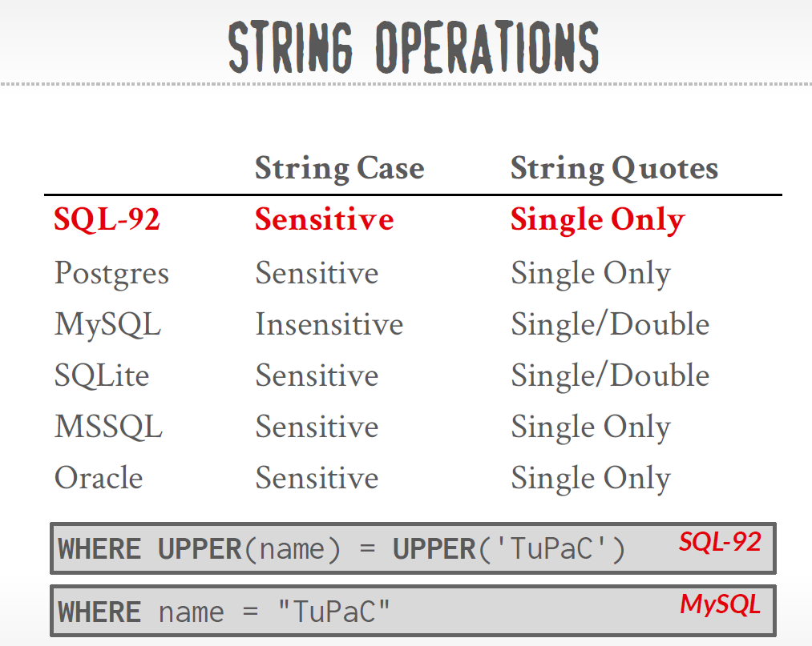

<!-- page 1 -->

## **Lecture #02: **

** (Fall 2025)**

https://15445.courses.cs.cmu.edu/fall2025/

Carnegie Mellon University

Andy Pavlo

### **1** **SQL History**

SQL is a declarative query language for relational databases. As oposed to imperative languages, in a declarative language the programmer/user only declares what needs to be done as oposed to how the operations should be done (e.g. Join these two tables). SQL was originally developed in the 1970s as part of the IBM **System R** project. IBM originally called it “SEQUEL” (Structured English Query Language). The name changed in the 1980s to just “SQL” (Structured Query Language).

Despite SQL being an old language, it is still being actively updated with new features every couple of

years. Some of the major updates released with each new edition of the SQL standard are shown below:

- **SQL:1999** Regular Expressions, Triggers

- **SQL:2003** XML, Windows, Sequences

- **SQL:2008** Truncation, Fancy Sorting

- **SQL:2011** Temporal DBs, Pipelined DML

- **SQL:2016** JSON, Polymorphic tables

- **SQL:2023** Property Graph Queries, Multi-Dimensional Arrays

The minimum language syntax a system needs to support in order to claim that it supports SQL is SQL-92.

Each vendor follows the standard to a certain degree and there are many proprietary extensions.


### **1.1 SQL Baiscs**


#### A SQL Query is Composed of Clauses

A clause is a major component (or section) of a SQL statement.
For example:
```sql
SELECT s.name, s.gpa
FROM student AS s
WHERE s.gpa > 3.5
ORDER BY s.gpa DESC;
```

This query consists of four clauses:

```sql
SELECT s.name, s.gpa        <-- SELECT clause
FROM student AS s           <-- FROM clause
WHERE s.gpa > 3.5           <-- WHERE clause
ORDER BY s.gpa DESC         <-- ORDER BY clause

```

Each clause has a different responsibility.
| Clause   | Purpose                                         |
| -------- | ----------------------------------------------- |
| SELECT   | What columns or expressions should be returned? |
| FROM     | Where does the data come from?                  |
| WHERE    | Which rows should be kept?                      |
| GROUP BY | How should rows be grouped?                     |
| HAVING   | Which groups should be kept?                    |
| ORDER BY | How should the results be sorted?               |
| LIMIT    | How many rows should be returned?               |


#### What is a Predicate?
A predicate is one of the most important concepts in SQL.

Formal Definition : A predicate is an expression that evaluates to TRUE/FALSE/UNKNOWN (because SQL has NULL)

In other words, A predicate asks a yes/no question.
```sql
salary > 5000

name LIKE 'A%'

gpa BETWEEN 3.0 AND 4.0

sid = 100
```

#### An Important Compiler Perspective

From the perspective of a database compiler:

- **Clauses** define the high-level structure of the SQL grammar (SELECT, FROM, WHERE, etc.).
- **Expressions** (columns, literals, arithmetic, function calls) appear inside clauses.
- **Predicates** are a special kind of expression whose result is Boolean, so they can control filtering.
- **Output** expressions are expressions in the SELECT clause that determine what values are returned.

This distinction is reflected directly in the AST. For example, a SelectStmt node has children representing different clauses, and the WHERE child contains a predicate expression tree, while the SELECT child contains output expression trees. Understanding this relationship makes it much easier to follow how a SQL parser, binder, and optimizer transform a query internally.


### **2** **Relational Languages**

The language is comprised of different classes of commands:

1. **Data Manipulation Language (DML):** SELECT , INSERT , UPDATE , and DELETE statements.

2. **Data Definition Language (DDL):** Schema definitions for tables, indexes, views, and other objects.

3. **Data Control Language (DCL):** Security and access controls.

4. It also includes view definition, integrity and referential constraints, and transactions.

Relational algebra (which is the algebra that SQL is based on) uses **sets** (unordered collections which do

not allow duplicates). However, SQL is based on **bags** (unordered collections which allow duplicates) to

avoid the extra work of removing duplicates by default. Duplicates can still be removed via features like

the DISTINCT keyword.

---

<!-- page 2 -->


### **3** **Example Database**

Here is the schema of a database we will use in our examples:
```SQL
CREATE TABLE student ( 
    sid INT PRIMARY KEY , 
    name VARCHAR (16), 
    login VARCHAR (32) UNIQUE , 
    age SMALLINT , 
    gpa FLOAT );

CREATE TABLE course ( 
    cid VARCHAR (32) PRIMARY KEY , 
    name VARCHAR (32) NOT NULL );

CREATE TABLE enrolled ( 
    sid INT REFERENCES student (sid), 
    cid VARCHAR (32) REFERENCES course (cid), 
    grade CHAR (1) );
```
**Figure 1:** Example database used for lecture

### **4** **Aggregates**

An aggregation function takes in a bag of tuples as its input and then produces a single scalar value as its output. 
Aggregate functions can (almost) only be used in a `SELECT` output list.


```SQL
- AVG(COL) : The average of the values in COL

- MIN(COL) : The minimum value in COL

- MAX(COL) : The maximum value in COL

- SUM(COL) : The sum of the values in COL

- COUNT(COL) : The number of tuples in the relation
```

Example: Get # of students with a ‘@cs’ login .

The following three queries are equivalent:


```SQL
SELECT COUNT (*) FROM student WHERE login LIKE '%@cs' ;

SELECT COUNT (login) FROM student WHERE login LIKE '%@cs' ;

SELECT COUNT (1) FROM student WHERE login LIKE '%@cs' ;
```
Some aggregate functions (e.g. COUNT , SUM , AVG ) support the DISTINCT keyword:

Example: Get # of unique students and their average GPA with a ‘@cs’ login .

```SQL
SELECT COUNT ( DISTINCT login) FROM student WHERE login LIKE '%@cs' ;
```


---

<!-- page 3 -->


A single SELECT statement can contain multiple aggregates:

Example: Get # of students and their average GPA with a ‘@cs’ login .

```SQL
SELECT AVG (gpa), COUNT (sid) FROM student  WHERE login LIKE '%@cs' ;
```

Output of other columns outside of an aggregate is undefined ( e.cid is undefined below).
Example: Get the average GPA of students in each course .
```SQL
SELECT AVG (s.gpa), e.cid 
FROM enrolled AS e JOIN student AS s 
ON e.sid = s.sid;
```

AVG(gpa) produces one value, while cid has multiple possible values.
Most real-world database systems will error in this case, but some systems such as SQLite will allow it by picking an arbitrary value. 
Therefore SQL reports an error: column "cid" must appear in GROUP BY...


**The SQL:2023 standard** now supports the `ANY_VALUE` aggregation function which does the same thing.
Example: Get the average GPA of students in each course .
```SQL
SELECT AVG (s.gpa), ANY_VALUE(e.cid) 
FROM enrolled AS e JOIN student AS s 
ON e.sid = s.sid;
```

Comment:
Without a GROUP BY, the query computes one single average over the entire joined table.
ANY_VALUE tells SQL: "I don't care which value you return". The database is free to choose any value from the group.


#### GROUP BY

Non-aggregated values in SELECT output clause must appear in the GROUP BY clause. This will partition the tuples based off of the value and calculate the aggregates for each subset. In this case there will be a canonical value for each group.

Example: Get the average GPA of students in each course.


```SQL
SELECT AVG(s.gpa), e.cid
FROM enrolled AS e JOIN student AS s
WHERE e.sid = s.sid   --- WHERE for joins, Legacy style when using comma-separated tables (FROM A, B),Equivalent to an inner join, but less explicit
GROUP BY e.cid;


SELECT AVG (s.gpa), e.cid 
FROM enrolled AS e JOIN student AS s 
ON e.sid = s.sid     --Modern, standard SQL syntax: JOIN ... ON ..., Specify the join predicate as part of the join operation
GROUP BY e.cid;
```


#### GROUPING SETS

The key idea is *GROUPING SETS performs several GROUP BY operations at once* .Instead of writing multiple queries.
Specify *multiple groupings* in a single query instead of using UNION ALL to combine the results of several individual GROUP BY queries.


Grouping sets can be used to specify *multiple groupings* in a single query rather than using UNION ALL to combine the results of several individual GROUP BY queries.
This results in the DBMS needing to only scan through the data once rather than multiple times.
The optimizer can compute all of these aggregates in a single scan of the data, which is much more efficient than executing multiple independent queries.


Example: Get the count of students by each course and grade, the count of students by course, and the total student count.
```SQL
SELECT c.name AS c_name, e.grade, COUNT (*) AS num_students 
FROM enrolled AS e JOIN course AS c 
ON e.cid = c.cid 
GROUP BY GROUPING SETS ( 
    (c.name, e.grade),  -- By course and grade
    (c.name),           -- By course only
    (),                 -- Overall total
    );
```


Normally we'd need three separate queries.
- GROUP BY course, grade
- GROUP BY course
- COUNT(*)
GROUPING SETS combines them BY
```sql
GROUP BY GROUPING SETS
(
    (course, grade),
    (course),
    ()
)
```

This literally means:

```sql
Run

GROUP BY course, grade : --First grouping

UNION ALL

GROUP BY course: -- Second grouping,There is no grade anymore. SQL fills it with NULL.

UNION ALL

GROUP BY nothing -- Third grouping, no grouping columns, Equivalent to SELECT COUNT(*)

-- Final result: The database concatenates everything:
| course | grade | count |
| ------ | ----- | ----: |
| DB     | A     |     2 |
| DB     | B     |     1 |
| AI     | A     |     1 |
| AI     | B     |     1 |
| DB     | NULL  |     3 |
| AI     | NULL  |     2 |
| NULL   | NULL  |     5 |

```


---

<!-- page 4 -->
#### HAVING clause
The `HAVING` clause filters output results based on aggregation computation (i.e. filters out groups as oposed to filtering rows which is what the `WHERE` clause does). This makes HAVING behave like a WHERE clause for a GROUP BY .

Example: Get the set of courses in which the average student GPA is greater than 3.9.
```sql
--- Wrong SQL
SELECT AVG(s.gpa) AS avg_gpa, e.cid 
FROM enrolled AS e, student AS s 
WHERE e.sid = s.sid 
AND  avg_gpa > 3.9  --- when you scan your data, how do you know whether to throw away a record or not?
GROUP BY e.cid 

--- Using HAVING clause at the bottom
SELECT AVG(s.gpa) AS avg_gpa, e.cid 
FROM enrolled AS e, student AS s 
WHERE e.sid = s.sid   
--- this example uses a legacy implicit join syntax (here the DBMS can deduce that a join is required to handle the WHERE clause.
--- You should always write out explicit joins in your queries.
GROUP BY e.cid 
HAVING avg_gpa > 3.9;
```

The above query syntax is supported by many major database systems, but is not compliant with the SQL standard. To make the query standard compliant, we must repeat use of `AVG(S.GPA)` in the body of the HAVING clause.

```sql
SELECT AVG(s.gpa), e.cid 
FROM enrolled AS e, student AS s 
WHERE e.sid = s.sid 
GROUP BY e.cid 
HAVING AVG(s.gpa) > 3.9;
```

### **5** **String Operations**

The SQL standard says that strings are **case sensitive** and **single-quotes only** . Real-world systems will vary in how loose they are about both points (e.g. MySQL).


There are functions to manipulate strings that can be used in any part of a query.

#### Pattern Matching:

The `LIKE` keyword is used for string matching in predicates.
- '%' matches any substrings (including empty).
- '_' matches any one character.

`SIMILAR TO `allows for *regular expression matching* but it is not supported across all systems as many have their own syntax instead.
→ In the SQL standard but not all systems support it.
→ Other systems also support POSIX-style regular expressions.

```sql
SELECT * FROM enrolled AS e
WHERE e.cid LIKE '15-%';

SELECT * FROM student AS s
WHERE s.login LIKE '%@c_';

SELECT * FROM student AS s
WHERE login SIMILAR TO
'[\w]{3}@cs';

```

#### String Functions
SQL-92 defines string functions. Many database systems implement other functions in  addition to those in the standard. 
Can be used in either output and predicates:
So "output" simply means: the expressions returned by the SELECT clause.

Examples of standard string functions include `SUBSTRING(S, B, E)` and `UPPER(S)` .

```sql
--- functions can appear in the SELECT clause
--- UBSTRING(name,1,5): produces the value that appears in the final result.
SELECT SUBSTRING(name,1,5) AS abbrv_name
FROM student WHERE sid = 53688

SELECT * FROM student AS s
WHERE UPPER(s.name) LIKE 'KAN%'
```
#### Concatenation:
Two vertical bars (“ || ”) will concatenate two or more strings together into a single string (but different systems might use a different symbol).

```sql
---SQL 92
SELECT name FROM student
WHERE login = LOWER(name) || '@cs'

--- MSSQL
SELECT name FROM student
WHERE login = LOWER(name) + '@cs'

--- MySQL
SELECT name FROM student
WHERE login = CONCAT(LOWER(name), '@cs')
```

### **6** **Date and Time**

Databases generally want to keep track of dates and time, so SQL supports operations to manipulate DATE and TIME attributes. 
These can be used as either outputs or predicates.

Specific syntax for date and time operations can vary wildly across systems.

Ex: 
UTC timezone
```sql
SELECT NOW();

SELECT CURRENT_TIMESTAMP();

SELECT CURRENT_TIMESTAMP;
```

Demo: Compute the number of days since the beginning of the year.

```sql
--------------POSTGRES
SELECT CAST('2025-08-27' AS DATE) - CAST('2025-01-01' AS DATE) AS days;
-- same as
SELECT '2025-08-27'::DATE - '2025-01-01'::DATE AS days;
--- days: 238

---------------MySQL
--- wrong way
SELECT CAST('2025-08-27' AS DATE) - CAST('2025-01-01' AS DATE) AS days; 
--- days: 726
SELECT CAST(DATE('2025-08-27') AS UNSIGNED); --- 20250827
SELECT CAST(DATE('2025-08-27') AS UNSIGNED) - CAST(DATE('025-01-01') AS UNSIGNED) AS days; 

---correct way
SELECT DATEDIFF(DATE('2025-08-27'), DATE('025-01-01')) AS days;

--------------SQLSERVER
SELECT DATEDIFF(DAY, '2025-01-01', GETDATE()) AS days;
```

---

<!-- page 5 -->


### **7** **Output Redirection**

Instead of having the result a query returned to the client (e.g., terminal), you can tell the DBMS to store the results into another table. You can then access this data in subsequent queries.

- **New Table:** Store the output of the query into a new (permanent) table.

```sql
---SQL 92
SELECT DISTINCT cid 
INTO CourseIds 
FROM enrolled;


---MySQL
CREATE TABLE CourseIds (
SELECT DISTINCT cid FROM enrolled);


--Postgres
SELECT DISTINCT cid
INTO TEMPORARY CourseIds  --- When close the clent, the TEMPORARY go away
FROM enrolled;
```

- **Existing Table:** Store the output of the query into a table that already exists in the database. The target table must have the same number of columns with the same types as the target table, but the names of the columns in the output query do not have to match.
  
```sql
INSERT INTO CourseIds 
( SELECT DISTINCT cid 
FROM enrolled);
```

----

### **8** **Output Control**

#### ORDER BY
Since results SQL are unordered, we must use the `ORDER BY` clause to impose a sort on tuples:

```sql
ORDER BY <column*> [ASC|DESC]
--- Sort tuples by the values in one or more of their columns.


SELECT sid, grade 
FROM enrolled 
WHERE cid = '15-721' 
ORDER BY grade;
```

The default sort order is ascending ( `ASC` ). We can manually specify DESC to reverse the order:

```sql
SELECT sid, grade 
FROM enrolled 
WHERE cid = '15-721' 
ORDER BY grade DESC ;
```

We can use multiple ORDER BY clauses to break ties or do more complex sorting:

```sql
SELECT sid, grade 
FROM enrolled 
WHERE cid = '15-721' 
ORDER BY grade DESC , sid ASC ;
```

We can also use any arbitrary expression in the ORDER BY clause:
```sql
SELECT sid 
FROM enrolled 
WHERE cid = '15-721' 
ORDER BY UPPER (grade) DESC , sid + 1 ASC ;
```

#### LIMIT

By default, the DBMS will return all of the tuples produced by the query. Many systems provide their own syntax for specifying how to get a set number of the first results from the output, but a common one is the `LIMIT` clause:

```sql
SELECT sid, name 
FROM student 
WHERE login LIKE '%@cs' 
LIMIT 10;
```

We can also provide an offset to return a range in the results:
```sql
SELECT sid, name 
FROM student 
WHERE login LIKE '%@cs' 
LIMIT 20 OFFSET 10;
```

#### FETCH ?
```sql
FETCH {FIRST|NEXT} <#> ROWS
OFFSET <#> ROWS
--- Limit # of tuples returned in output.
--- Can set an offset to return a “range”


SELECT sid, name FROM student
WHERE login LIKE '%@cs'
FETCH FIRST 10 ROWS ONLY;

SELECT sid, name FROM student
WHERE login LIKE '%@cs'
ORDER BY gpa
OFFSET 5 ROWS
FETCH FIRST 5 ROWS WITH TIES;

--- MSSQL
SELECT TOP 10 sid, name
FROM student
WHERE login LIKE '%@cs';
```


Unless we use an ORDER BY clause with a LIMIT , the DBMS may produce different tuples in the result on each invocation of the query because the relational model does not impose an ordering.

SQL also allows you to store query results into a different table with the `INTO` keyword (some systems even allow redirection into a temporary table with `INTO TEMPORARY` ).


---

<!-- page 6 -->

### **9** **Window Functions**

A window function performs “sliding” calculation across a set of tuples that are related. 
Window functions are similar to aggregations, but tuples are not collapsed into a singular output tuple.

```sql
--- FUNC-NAME(...) : Aggregation Functions/Special Functions
--- OVER(...):  How to slice up data, Can also sort tuples
SELECT FUNC-NAME(...) OVER (...)   
FROM tableName;

```
The conceptual execution for window functions can be imagined as such ( note that not all window functions will behave like this ):

1. The table is partitioned

2. Each partition is sorted (if there is an ORDER BY clause)

3. For each record, it creates a window spanning multiple records

4. Finally the output is computed for each window


**Functions:** 

The window function can be any of the ==aggregation functions== that we discussed above. 
There are also also special window functions:

1. `ROW_NUMBER()` : The number of the current row.

2. `RANK` : The order position of the current row.
```sql
SELECT *, ROW_NUMBER() OVER () AS row_num
FROM enrolled;

```


**Grouping:** 
The `OVER` clause specifies how to group together tuples when computing the window function.

Use `PARTITION BY` to specify group.

```sql
SELECT cid, sid, 
    ROW_NUMBER() OVER (PARTITION BY cid) 
    FROM enrolled 
    ORDER BY cid;
```

We can also put an ORDER BY within OVER to ensure a deterministic ordering of results even if database changes internally.

```sql
SELECT *, 
    ROW_NUMBER() OVER ( ORDER BY cid) 
    FROM enrolled 
ORDER BY cid;
```
**IMPORTANT** : The DBMS computes RANK after the window function sorting, whereas it computes ROW NUMBER before the sorting.

Example: Find the student with the second highest grade for each course .

```sql
SELECT * FROM ( 
    SELECT *, RANK() OVER (PARTITION BY cid --- Group tuples by cid then sort by grade
    ORDER BY grade ASC ) AS rank 
    FROM enrolled) AS ranking 
    WHERE ranking.rank = 2;
```


Note that we order by ASC because the grades are A, B, C instead of number grades.


---
This is one of the most important features in modern SQL. Window Functions were added in SQL:2003 and are considered one of the greatest improvements to SQL because they allow you to **perform calculations across related rows without collapsing the result set**.

If `GROUP BY` is one of SQL's most fundamental concepts, then **Window Functions are the next major milestone**.

Since you're learning database systems from first principles, let's understand them from the motivation, then the syntax, and finally how a DBMS executes them.

#### 1. Why Do Window Functions Exist?

Suppose we have the following table:

##### enrolled

| cid   | sid | grade |
| ----- | --- | ----- |
| CS101 | 1   | A     |
| CS101 | 2   | B     |
| CS101 | 3   | C     |
| CS102 | 4   | A     |
| CS102 | 5   | B     |

Suppose we want:

> Show every student **together with the average grade of his course.**

Without window functions, we'd have to write:

```sql
SELECT
    e.sid,
    e.cid,
    avg_table.avg_grade
FROM enrolled e
JOIN (
    SELECT
        cid,
        AVG(grade) AS avg_grade
    FROM enrolled
    GROUP BY cid
) avg_table
ON e.cid = avg_table.cid;
```

Notice we had to:

* group
* create an intermediate table
* join back

This is cumbersome.

---

Window Functions let us write:

```sql
SELECT
    sid,
    cid,
    AVG(grade) OVER (PARTITION BY cid)
FROM enrolled;
```

Much cleaner.

---

#### 2. What is a Window?

The word **window** is actually a visualization.

Imagine one row is being processed.

Instead of looking at the whole table,

the function looks through a **window** of related rows.

Suppose

```text
CS101

A
B
C
```

Current row

```text
B
```

Its window is

```text
A
B
C
```

because they all belong to

```text
CS101
```

Now

Current row

```text
A
```

Window

```text
A
B
C
```

Same window.

The window moves row by row.

---

#### 3. GROUP BY vs Window Function

This is the most important comparison.

##### GROUP BY

Input

| cid   | grade |
| ----- | ----- |
| CS101 | A     |
| CS101 | B     |
| CS102 | A     |

After

```sql
GROUP BY cid
```

Result

| cid   | AVG |
| ----- | --- |
| CS101 | ... |
| CS102 | ... |

Notice

Three rows

↓

Two rows

Rows are **collapsed**.

---

Window Function

```sql
AVG(...)
OVER(...)
```

Result

| cid   | grade | avg |
| ----- | ----- | --- |
| CS101 | A     | ... |
| CS101 | B     | ... |
| CS102 | A     | ... |

Same number of rows.

Nothing disappears.

This is the biggest difference.

---

#### 4. General Syntax

```sql
FUNCTION(...)
OVER(...)
```

The

```sql
OVER(...)
```

defines

> **Which rows should this function look at?**

Think of it as

```text
Function

+

Window Definition
```

---

#### 5. OVER Clause

The syntax

```sql
OVER (
    PARTITION BY ...
    ORDER BY ...
)
```

contains two different ideas.

---

##### PARTITION BY

Splits rows into groups.

Like

```sql
GROUP BY
```

Except

it **doesn't collapse rows.**

Suppose

```text
CS101

A
B
C
```

and

```text
CS102

A
B
```

The partitions are

```text
Partition 1

A
B
C
```

```text
Partition 2

A
B
```

---

##### ORDER BY

Sorts rows **inside each partition**.

Suppose

```text
90
60
80
```

After

```sql
ORDER BY grade DESC
```

becomes

```text
90
80
60
```

---

#### 6. Execution Pipeline

Suppose

```sql
SELECT
    *,
    ROW_NUMBER()
    OVER(
        PARTITION BY cid
        ORDER BY grade DESC
    )
FROM enrolled;
```

Execution

##### Step 1

Read table

```text
A

B

C

...
```

↓

##### Step 2

Partition

```text
CS101

...

CS102

...
```

↓

##### Step 3

Sort each partition

```text
CS101

A

B

C
```

↓

##### Step 4

Move the window

```text
Current Row
```

↓

##### Step 5

Compute

```text
ROW_NUMBER
```

---

#### 7. ROW_NUMBER()

This is the easiest window function.

Suppose

| cid   | sid |
| ----- | --- |
| CS101 | 10  |
| CS101 | 20  |
| CS101 | 30  |

Query

```sql
SELECT
    cid,
    sid,
    ROW_NUMBER()
    OVER(PARTITION BY cid)
FROM enrolled;
```

Result

| cid   | sid | row_number |
| ----- | --- | ---------- |
| CS101 | 10  | 1          |
| CS101 | 20  | 2          |
| CS101 | 30  | 3          |

It simply counts rows.

---

#### 8. RANK()

Suppose grades

| Student | Grade |
| ------- | ----- |
| Alice   | 98    |
| Bob     | 98    |
| Charlie | 90    |
| David   | 80    |

Query

```sql
RANK()
OVER(ORDER BY grade DESC)
```

Result

| Grade | Rank |
| ----- | ---- |
| 98    | 1    |
| 98    | 1    |
| 90    | 3    |
| 80    | 4    |

Notice

Rank

```text
1

1

3

4
```

It skips

```text
2
```

because of the tie.

---

#### 9. DENSE_RANK()

Result

```text
1

1

2

3
```

No gap.

---

#### 10. ROW_NUMBER vs RANK

Suppose

Grades

```text
100

100

90
```

ROW_NUMBER

```text
1

2

3
```

Every row gets a unique number.

---

RANK

```text
1

1

3
```

Equal values share the same rank.

---

#### 11. Aggregate Window Functions

Aggregate functions also work as window functions.

Example

```sql
SELECT
    sid,
    cid,
    AVG(gpa)
    OVER(PARTITION BY cid)
FROM student;
```

Suppose

CS101

```text
3.0

4.0

2.0
```

Average

```text
3.0
```

Output

```text
3.0

3.0

3.0
```

Each row receives

the average.

---

#### 12. Running Total

One of the most common uses.

```sql
SUM(score)
OVER(
    ORDER BY exam
)
```

Suppose

| Exam | Score |
| ---- | ----- |
| 1    | 70    |
| 2    | 80    |
| 3    | 60    |

Result

| Exam | Running Sum |
| ---- | ----------- |
| 1    | 70          |
| 2    | 150         |
| 3    | 210         |

Notice

Window grows

```text
70
```

↓

```text
70

80
```

↓

```text
70

80

60
```

---

#### 13. Window Frames

This is the part many beginners skip, but it's essential.

The `OVER` clause defines **the partition and the order**, but the **window frame** defines **which rows around the current row** are included in the calculation.

For example:

```sql
SUM(score)
OVER (
    ORDER BY exam
    ROWS BETWEEN 1 PRECEDING AND CURRENT ROW
)
```

Suppose:

| Exam | Score |
| ---- | ----: |
| 1    |    70 |
| 2    |    80 |
| 3    |    60 |
| 4    |    90 |

The windows are:

| Current Exam | Window | Sum |
| ------------ | ------ | --: |
| 1            | 70     |  70 |
| 2            | 70,80  | 150 |
| 3            | 80,60  | 140 |
| 4            | 60,90  | 150 |

This is called a **sliding window**, and it's widely used for moving averages, rolling sums, and time-series analysis.

---

#### 14. How Does the DBMS Execute Window Functions?

A typical execution plan looks like this:

```text
Table Scan
      │
      ▼
Partition Operator
      │
      ▼
Sort Operator
      │
      ▼
Window Operator
      │
      ▼
Output
```

The **Window Operator** is a physical operator in many database engines (such as PostgreSQL, SQL Server, and DuckDB). It processes rows partition by partition, maintaining the state needed for functions like `ROW_NUMBER`, `RANK`, or `SUM`.

Some functions are very cheap:

```text
ROW_NUMBER

Counter++

Done
```

Others require maintaining additional state:

```text
AVG

Maintain

Sum

+

Count
```

Still others (like moving averages with custom frames) may maintain queues or buffers to efficiently add new rows and remove rows leaving the frame.

---

#### 15. Relationship with Other SQL Features

Here's how window functions fit into the SQL ecosystem:

```text
                         SQL
                          │
        ┌─────────────────┼─────────────────┐
        │                 │                 │
        ▼                 ▼                 ▼
     GROUP BY       Window Function      Nested Query
        │                 │                 │
   Collapse Rows     Preserve Rows     Create New Relation
        │                 │                 │
        ▼                 ▼                 ▼
   Aggregate        Per-row Analysis   Intermediate Result
```

Compare them:

| Feature                       | GROUP BY  | Window Function                          | CTE                       | Subquery   |
| ----------------------------- | --------- | ---------------------------------------- | ------------------------- | ---------- |
| Collapses rows                | ✅ Yes     | ❌ No                                     | Depends                   | Depends    |
| Creates intermediate relation | ❌         | ❌                                        | ✅                         | ✅          |
| Adds new columns              | Sometimes | ✅ Yes                                    | Depends                   | Depends    |
| Computes over related rows    | Limited   | ✅ Excellent                              | Via query                 | Via query  |
| Typical use                   | Summaries | Ranking, running totals, moving averages | Structure complex queries | Nest logic |

---

#### 16. A Real-World Example

Suppose you have sales data:

| Salesperson | Month | Sales |
| ----------- | ----- | ----: |
| Alice       | Jan   |   100 |
| Alice       | Feb   |   120 |
| Alice       | Mar   |   150 |
| Bob         | Jan   |    80 |
| Bob         | Feb   |   110 |

You can compute each salesperson's cumulative sales:

```sql
SELECT
    salesperson,
    month,
    sales,
    SUM(sales) OVER (
        PARTITION BY salesperson
        ORDER BY month
    ) AS cumulative_sales
FROM sales;
```

Result:

| Salesperson | Month | Sales | Cumulative |
| ----------- | ----- | ----: | ---------: |
| Alice       | Jan   |   100 |        100 |
| Alice       | Feb   |   120 |        220 |
| Alice       | Mar   |   150 |        370 |
| Bob         | Jan   |    80 |         80 |
| Bob         | Feb   |   110 |        190 |

This would be much harder to express cleanly with only `GROUP BY`.

---

#### The Key Insight

If you remember just one sentence, make it this:

> **`GROUP BY` summarizes groups into fewer rows; Window Functions analyze groups while preserving every original row.**

That's why window functions are indispensable for analytics: they let you ask questions like "What is this employee's salary rank within their department?", "What is the running total of sales?", or "What is the moving average over the last 7 days?"—all while keeping every row of the original data visible.


### **10** **Nested Queries**

Nested queries invoke queries inside of other queries to execute more complex logic within a single query. Nested queries are often difficult to optimize.

The scope of the outer query is included in an inner query (i.e. the inner query can access attributes from outer query). The opposite is not true.

Inner queries can appear in almost any part of a query:

1. SELECT Output Targets:

```sql
-- iterates over every row of student.
-- For each row, it evaluates (SELECT 1),Since that subquery always returns 1
--- the final result is:
-- | one |
-- | --- |
-- | 1   |
-- | 1   |
-- | 1   |

SELECT ( SELECT 1) AS one  subquery.
FROM student;


```
SELECT 1:  is simply a literal constant. It is a constant scalar 
returns exactly one row, one column, 

Why would anyone write SELECT 1?
- Testing: Many database clients execute this to check whether the database connection is alive.
- EXISTS: We don't actually care what the subquery returns. We only care Does it return at least one row?

```sql
SELECT name
FROM student s
WHERE EXISTS (
    SELECT 1 --- People could also write SELECT * or SELECT sid
    FROM enrolled e
    WHERE e.sid = s.sid
);
```


2. FROM Clause:

```sql
SELECT name 
FROM student AS s, ( SELECT sid FROM enrolled) AS e WHERE s.sid = e.sid;
```


3. WHERE Clause:
```sql
SELECT name   ---Outer query
FROM student 
WHERE sid IN ( SELECT sid FROM enrolled ); ---inner query


-- The previous query is equivalent to
SELECT DISTINCT s.name
FROM student s
JOIN enrolled e
ON s.sid=e.sid;
-- The optimizer often transforms IN into  SEMI JOIN internally.
```

Example: Get the names of students that are enrolled in ‘15-445’ .
```sql
SELECT name from student
WHERE ... --- sid in the set of people that take 15-445

SELECT name from student
WHERE ...
SELECT sid from enrolled
WHERE cid= '15-445'


SELECT name FROM student 
WHERE sid IN
 ( SELECT sid FROM enrolled 
   WHERE cid = '15-445' );
```
Note that sid has a different scope depending on where it appears in the query.

#### Example: 
Find student record with the highest id that is enrolled in at least one course .

```sql
-- method1: using WHERE IN inner query
SELECT sid, name FROM student
WHERE ... --- Is the highest enrolled sid


SELECT sid, name FROM student
WHERE sid =
   SELECT MAX(sid) FROM enrolled


SELECT sid, name FROM student
WHERE sid IN (
    SELECT MAX(sid) FROM enrolled
);

-- method2: sort the sid column and fetch the first row
SELECT sid, name FROM student
WHERE sid IN (
SELECT sid FROM enrolled
ORDER BY sid DESC       
FETCH FIRST 1 ROW ONLY  
);

-- method3 : join the table in the inner query
SELECT student.sid, name 
FROM student 
JOIN ( SELECT MAX (sid) AS sid 
       FROM enrolled) AS max_e 
ON student.sid = max_e.sid;
```


#### Nested Query Results Expressions:

- `ALL` : Must satisfy expression for all rows in sub-query.

- `ANY` : Must satisfy expression for at least one row in sub-query.

- `IN` : Equivalent to =ANY() .

- `EXISTS` : At least one row is returned.

Example: Find all courses that have no students enrolled in it .

```sql
SELECT cid FROM cousre
where ... --- courses have no students enrolled in it.

SELECT * FROM course
WHERE ... --- with no tuples in the errolled table

SELECT * FROM course
WHERE NOT EXISTS(
    --- tuples in the errolled table
)


SELECT * FROM course 
WHERE NOT EXISTS 
( SELECT * FROM enrolled 
WHERE course.cid = enrolled.cid );


```
### **11** **Lateral Joins**

The `LATERAL` operator allows a nested query to reference attributes in other nested queries that precede it(according to position in the query). 
You can think of lateral joins like a `for` loop that allows you to invoke another query for each tuple in a table.

```sql
SELECT * FROM
(SELECT 1 AS x) AS t1,              -- Step1: First evaluate
LATERAL (SELECT t1.x+1 AS y) AS t2; -- Step 2: The query can access t1.x because of LATERAL

-- Step 3 : Join them
-- | x | y |
-- | - | - |
-- | 1 | 2 |

for x in [1]:
  for y in [x+1]:
     print(x,y)

```

The intuition given in your slides is actually very good:
> **A LATERAL join is like a `for` loop.**

I would go even further:
> **A LATERAL subquery is essentially a parameterized table-valued function that is invoked once for every row produced so far in the `FROM` clause.**
This is how PostgreSQL's planner thinks about it.

---

#### Why was LATERAL introduced?

Let's first understand what problem it solves.

Suppose we have

```sql
student(sid, name, gpa)

course(cid, name)

enrolled(sid, cid)
```

Suppose we want

> For each course, compute the average GPA of enrolled students.

Intuitively we want to do

```text
for each course:
    compute average GPA
```

The problem is:

A normal subquery in the `FROM` clause **cannot** reference columns from other tables in the same `FROM` clause.

For example,

```sql
SELECT *
FROM course c,
(
    SELECT AVG(gpa)
    FROM student s
    JOIN enrolled e
      ON s.sid = e.sid
    WHERE e.cid = c.cid      -- ❌ illegal without LATERAL
) t;
```

The parser complains because `c.cid` **doesn't** exist inside that subquery's scope.

#### Normal FROM Clause Scope

Normally,

```sql
FROM A,  B
```
means A and B are independent. A cannot see B , B cannot see A
Each table expression is evaluated independently.

---

#### What LATERAL Changes

Now write

```sql
FROM course c,
LATERAL (...)
```

Now the second table can see everything that appeared before it.

```text
course c
     │
     ▼
LATERAL subquery
```

Think of it as

```text
course

↓

produce one row

↓

run lateral query

↓

produce result

↓

next course

↓

run lateral query again
```

The lateral query is evaluated once per outer row.

---


#### A Better Example
Count the num of student for each enroolled course

Suppose Course

| cid   | name |
| ----- | ---- |
| CS101 | DB   |
| CS102 | OS   |
| CS103 | AI   |

Enrollment

| sid | cid   |
| --- | ----- |
| 1   | CS101 |
| 2   | CS101 |
| 3   | CS102 |

---

Now

```sql
SELECT
    c.cid,
    t.cnt
FROM course c,
LATERAL
(
    SELECT COUNT(*) AS cnt
    FROM enrolled e
    WHERE e.cid=c.cid
) t;
```

Let's execute it manually.

---

1. First Course

```text
c

CS101
```

Run

```sql
SELECT COUNT(*)
FROM enrolled
WHERE cid='CS101'
```

Result

```text
2
```

Output

```text
CS101 2
```

---

2. Second Course

```text
CS102
```

Run

```sql
SELECT COUNT(*)
FROM enrolled
WHERE cid='CS102'
```

↓

```text
1
```

Output

```text
CS102 1
```

---

3. Third Course

```text
CS103
```

Run

```sql
SELECT COUNT(*)
FROM enrolled
WHERE cid='CS103'
```

↓

```text
0
```

Output

```text
CS103 0
```

Final table

| cid   | cnt |
| ----- | --- |
| CS101 | 2   |
| CS102 | 1   |
| CS103 | 0   |

---

####  Example: 
Calculate the number of students enrolled in each course and the average GPA. Sort by enrollment count in descending order. .

Once we have gotten the course records, we can think of this query like below. For each course:
- Compute the number of enrolled students in this course
- Compute the average GPA of the enrolled students in this course

```sql
SELECT * FROM course AS c,
For each course:
-> Computer the # of enrolled students
-> Computer the average GPA of enrolled student


SELECT * 
FROM course AS c 
LATERAL 
( 
    SELECT COUNT (*) AS cnt 
    FROM enrolled 
    WHERE enrolled.cid = c.cid) 
    AS t1, 

LATERAL 
( 
    SELECT AVG (gpa) AS avg 
    FROM student AS s 
    JOIN enrolled AS e 
    ON s.sid = e.sid 
    WHERE e.cid = c.cid) 
    AS t2;
ORDER  BY cnt DEC;
```

Imagine execution.

---

Course 1

```text
CS101
```

Run first lateral

```sql
COUNT(*)
```

↓

```text
35
```

Run second lateral

```sql
AVG(gpa)
```

↓

```text
3.62
```

Output

```text
CS101

35

3.62
```

---

Course 2

```text
CS102
```

↓

```text
18

3.84
```

---

Course 3

↓

```text
10

3.20
```

The execution is literally

```python
for course in courses:

    cnt = count_students(course.cid)

    avg = average_gpa(course.cid)

    print(course, cnt, avg)
```

---

#### Execution Pipeline

A database executes something conceptually like

```text
Scan Course
     │
     ▼
One Course Row
     │
     ▼
Run Lateral Query #1
     │
     ▼
Run Lateral Query #2
     │
     ▼
Output Row
     │
     ▼
Next Course
```

Notice

The lateral query is **executed repeatedly**.

---

#### Relation to Correlated Subqueries

You've already learned correlated subqueries:

```sql
SELECT name
FROM student s
WHERE EXISTS
(
    SELECT *
    FROM enrolled e
    WHERE e.sid=s.sid
);
```

This inner query references

```text
s.sid
```

So it is **correlated**.

A `LATERAL` subquery is very similar:

```sql
FROM course c,

LATERAL (...)
```

The difference is where it appears:

| Correlated Subquery                               | LATERAL                 |
| ------------------------------------------------- | ----------------------- |
| WHERE clause                                      | FROM clause             |
| Returns Boolean/scalar/table depending on context | Returns a table         |
| Evaluated per outer row                           | Evaluated per outer row |

So a LATERAL subquery is essentially a **correlated table expression**.

---

#### AST View

Suppose

```sql
SELECT *
FROM course c,
LATERAL (...)
```

The parser builds something conceptually like

```text
SelectStmt
│
├── FROM
│      ├── course c
│      │
│      └── LATERAL
│             │
│             ▼
│        SELECT ...
│        WHERE cid=c.cid
```

Notice

The parser records

```text
LATERAL
```

as a dependency.

During semantic analysis (binding),

the binder allows

```text
c.cid
```

to be resolved because

```text
course c
```

appeared earlier in the `FROM` clause.

Without `LATERAL`, the binder would reject the reference with an error because names from sibling `FROM` items are normally **not visible** to each other.

---

#### Why Is LATERAL Powerful?

Most developers first see `LATERAL` used for aggregates like your example, but in production systems it's especially valuable for **table-valued functions** and **Top-N-per-group** queries.

For example, suppose you want the **top-scoring student in each course**:

```sql
SELECT
    c.cid,
    t.sid,
    t.grade
FROM course AS c
CROSS JOIN LATERAL (
    SELECT e.sid, e.grade
    FROM enrolled AS e
    WHERE e.cid = c.cid
    ORDER BY e.grade DESC
    LIMIT 1
) AS t;
```

Conceptually, this executes:

```python
for course in courses:
    top_student = highest_grade(course.cid)
    print(course.cid, top_student)
```

Without `LATERAL`, expressing this pattern is much more cumbersome and often requires window functions or multiple nested subqueries.

---

#### Summary

Think of these SQL constructs in terms of their programming-language equivalents:

| SQL Construct       | Programming Analogy                                        | Uses Outer Row? |
| ------------------- | ---------------------------------------------------------- | --------------- |
| Regular `JOIN`      | Nested loops over two independent collections              | ❌ No            |
| Correlated subquery | Function call inside an `if` statement                     | ✅ Yes           |
| `LATERAL`           | **Function call inside a `for` loop that returns a table** | ✅ Yes           |

The key mental model to remember is:

```text
FROM course c,
LATERAL (subquery using c.cid)
```

is conceptually equivalent to:

```python
for course in courses:
    result_rows = subquery(course.cid)
    for row in result_rows:
        emit(course, row)
```

This is why `LATERAL` is sometimes described as **bringing parameterized table-valued functions into SQL**: each row produced so far becomes an input parameter to the next table expression. Once you understand that execution model, the syntax becomes much more intuitive.


### **12** **Common Table Expressions**

Common Table Expressions (CTEs) are an alternative to windows or nested queries when writing more complex queries. They provide a way to write auxiliary statements for use in a larger query. A CTE can be thought of as a temporary table that is scoped to a single query.
Alternative to nested queries, views, and explicit temp tables.

The `WITH` clause binds the output of the inner query to a temporary table with the same name.
```sql
WITH cteName (col1, col2) AS (
SELECT 1, 2
)
SELECT col1 + col2 FROM cteName
```

Example: Generate a CTE called cteName that contains a single tuple with a single attribute set to “1”. Select all attributes from cteName .

```sql
WITH cteName AS ( SELECT 1 ) 
SELECT * FROM cteName;
```

We can bind output columns to names before the AS :
```sql
WITH cteName (col1, col2) AS ( SELECT 1, 2 ) 
SELECT col1 + col2 FROM cteName;
```

A single query may contain multiple CTE declarations:
```sql
WITH cte1 (col1) AS ( SELECT 1), cte2 (col2) AS ( SELECT 2)
SELECT * FROM cte1, cte2;
```


#### Example(In Nested Queries): 
Find student record with the highest id that is enrolled in at least one course .

```sql
with sid, name as students  --- that is enrolled in at least on course
SELECT MAX(sid) from students;


WITH maxCTE (maxID) AS(
    SELECT MAX(sid) FROM enrolled
)
SELECT name FROM student AS s
JOIN maxCTE ON s.sid = maxCTE.maxID

```

#### RECURSIVE

Adding the `RECURSIVE` keyword after `WITH` allows a CTE to reference itself. This enables the implementation of recursion in SQL queries. With recursive CTEs, SQL is provably Turing-complete, implying that it is as computationally expressive as more general purpose programming languages (ignoring the fact that it is a bit more cumbersome).

Example: Print the sequence of numbers from 1 to 10 .

```sql
WITH RECURSIVE cteSource (counter) AS ( ( SELECT 1 ))
```


**UNION**

( SELECT counter + 1 FROM cteSource WHERE counter < 10 ) SELECT * FROM cteSource;


---

Excellent question. **Common Table Expressions (CTEs)** are one of the most useful SQL features, but they are often confused with **subqueries, views, temporary tables, and window functions** because all of them can be used to simplify complex queries.

The key is that they solve **different problems**.

#### 1. What is a Common Table Expression?

The official SQL definition is:

> A **Common Table Expression (CTE)** is a **named temporary result set** that exists only for the duration of a single SQL statement.

Think of it as creating a temporary relation:

```text
WITH employee_gpa AS (
      SELECT ...
)
```

The DBMS behaves **as if** it created a temporary table named

```text
employee_gpa
```

that exists only while executing this query.

---

##### Example

```sql
WITH TopStudents AS (
    SELECT *
    FROM student
    WHERE gpa > 3.5
)
SELECT name
FROM TopStudents;
```

Conceptually

```text
student
      │
      ▼
SELECT *
WHERE gpa > 3.5
      │
      ▼
Temporary Relation
TopStudents
      │
      ▼
SELECT name
```

After the query finishes,

```text
TopStudents
```

disappears.

---

#### 2. Why Do We Need CTEs?

Suppose we write

```sql
SELECT name
FROM
(
    SELECT *
    FROM student
    WHERE gpa>3.5
) t
WHERE name LIKE 'A%';
```

This works.

But imagine

```text
Nested Query
      │
      └── Nested Query
              │
              └── Nested Query
```

After 5 or 6 levels, it becomes almost unreadable.

A CTE allows us to name intermediate results.

Instead of

```text
Huge nested query
```

we get

```text
Student
    │
    ▼
TopStudents
    │
    ▼
HonorStudents
    │
    ▼
Final Query
```

Much easier to understand.

---

#### 3. How WITH Works

Consider

```sql
WITH cteName AS
(
    SELECT 1
)
SELECT *
FROM cteName;
```

Execution is conceptually

Step 1

```sql
SELECT 1;
```

Result

| ?column? |
| -------- |
| 1        |

Create temporary relation

```text
cteName

+---+
|1 |
+---+
```

Now execute

```sql
SELECT *
FROM cteName;
```

Result

| ?column? |
| -------- |
| 1        |

After execution

```text
cteName
```

is destroyed.

---

#### 4. Multiple CTEs

```sql
WITH

A AS
(
    SELECT ...
),

B AS
(
    SELECT ...
)

SELECT ...
FROM A
JOIN B;
```

Execution

```text
Student
      │
      ▼
      A

Course
      │
      ▼
      B

A JOIN B
```

Each CTE can reference earlier CTEs.

---

#### 5. Recursive CTEs

This is where CTEs become much more powerful.

Normal CTE

```text
Student

↓

Temporary Table

↓

Done
```

Recursive CTE

```text
CTE

↓

Produces Rows

↓

Feeds itself

↓

Produces More Rows

↓

Until stopping condition
```

Example

```sql
WITH RECURSIVE numbers(n) AS
(
    SELECT 1

    UNION ALL

    SELECT n+1
    FROM numbers
    WHERE n<10
)

SELECT *
FROM numbers;
```

Result

```text
1
2
3
4
5
6
7
8
9
10
```

This is essentially recursion expressed in SQL.

Conceptually

```python
def numbers(n):

    print(n)

    if n<10:

        numbers(n+1)
```

---

#### 6. CTE vs Nested Query

Consider

Nested query

```sql
SELECT *
FROM
(
    SELECT *
    FROM student
    WHERE gpa>3.5
) t;
```

Equivalent CTE

```sql
WITH TopStudents AS
(
    SELECT *
    FROM student
    WHERE gpa>3.5
)

SELECT *
FROM TopStudents;
```

They produce the same result.

The difference is readability.

Nested query

```text
SELECT

↓

Nested

↓

Nested

↓

Nested
```

CTE

```text
Student

↓

TopStudents

↓

Graduates

↓

Result
```

Much easier to read.

---

#### 7. CTE vs View

This confuses many beginners.

View

```sql
CREATE VIEW HonorStudents AS
SELECT *
FROM student
WHERE gpa>3.5;
```

This becomes part of the database catalog.

It exists until

```sql
DROP VIEW;
```

A CTE

```sql
WITH HonorStudents AS
(...)
```

exists only during one query.

---

####### Lifetime

View

```text
Database

↓

Forever
```

CTE

```text
One SQL statement

↓

Destroyed
```

---

####### Stored Where?

View

```text
Catalog
```

CTE

```text
Query Plan
```

No catalog entry.

---

#### 8. CTE vs Temporary Table

Temporary table

```sql
CREATE TEMP TABLE TopStudents AS
SELECT *
FROM student;
```

This creates an actual table.

It occupies storage.

It has statistics.

Indexes can be created.

Multiple SQL statements can use it.

CTE

```sql
WITH TopStudents AS (...)
```

No actual table necessarily exists.

It is scoped to one query.

---

Example

Temporary table

```sql
CREATE TEMP TABLE A AS ...

SELECT ...

UPDATE A ...

SELECT ...

DROP TABLE A;
```

CTE

```sql
WITH A AS (...)

SELECT ...
```

Finished.

Gone.

---

#### 9. CTE vs Window Functions

This comparison is interesting because people often use them for similar reports.

Suppose

```sql
SELECT
    name,
    RANK() OVER (...)
FROM student;
```

Window functions compute

```text
One output row

↓

One input row
```

Rows are preserved.

---

CTE

Produces

```text
Intermediate Relation
```

It can change

* number of rows
* columns
* grouping

Window functions cannot replace CTEs.

---

Example

Window

```sql
SELECT
    name,
    AVG(gpa)
    OVER(PARTITION BY major)
FROM student;
```

Every student remains.

---

CTE

```sql
WITH AvgMajor AS
(
    SELECT
        major,
        AVG(gpa)
    FROM student
    GROUP BY major
)
```

Now we have

one row per major.

Different purpose.

---

#### 10. Internal Architecture

Suppose

```sql
WITH A AS (...)
SELECT ...
FROM A;
```

Parser

↓

AST

```text
SelectStmt
│
├── WITH
│      │
│      ▼
│   CommonTableExpr
│
└── SELECT
```

The binder

records

```text
A

↓

Temporary Relation
```

The optimizer decides

Should

```text
A
```

be

* materialized?
* inlined?

Modern PostgreSQL often inlines simple CTEs unless you explicitly request materialization.

---

#### 11. Optimizer Behavior

Historically (PostgreSQL before version 12):

Every CTE acted as an **optimization fence**.

```text
CTE

↓

Materialize

↓

Continue
```

Since PostgreSQL 12:

The optimizer may inline the CTE into the main query when that produces a better execution plan.

You can even control this behavior:

```sql
WITH t AS MATERIALIZED (
    SELECT ...
)
SELECT ...
FROM t;
```

or

```sql
WITH t AS NOT MATERIALIZED (
    SELECT ...
)
SELECT ...
FROM t;
```

This demonstrates an important point:

> **A CTE is a logical construct. The optimizer is free to decide how to execute it.**

---

#### 12. Comparison Summary

| Feature                       | Nested Query   | CTE               | View       | Temp Table             | Window Function             |
| ----------------------------- | -------------- | ----------------- | ---------- | ---------------------- | --------------------------- |
| Named                         | ❌              | ✅                 | ✅          | ✅                      | ❌                           |
| Lifetime                      | One expression | One SQL statement | Persistent | Session/transaction    | One expression              |
| Stored in catalog             | ❌              | ❌                 | ✅          | ❌ (temporary metadata) | ❌                           |
| Can be reused in same query   | Difficult      | ✅                 | ✅          | ✅                      | N/A                         |
| Can be reused across queries  | ❌              | ❌                 | ✅          | ✅ (while it exists)    | ❌                           |
| Can be recursive              | ❌              | ✅                 | ❌          | ❌                      | ❌                           |
| Usually improves readability  | Sometimes      | **Excellent**     | Excellent  | Good                   | No                          |
| Represents a relation (table) | ✅              | ✅                 | ✅          | ✅                      | ❌ (computes values per row) |

---

#### 13. Relationship Between All These Concepts

Here's a mental model that unifies everything you've learned over the past several questions:

```text
                       SQL Query
                           │
        ┌──────────────────┼──────────────────┐
        │                  │                  │
        ▼                  ▼                  ▼
   Nested Query          CTE               Window Function
   (Subquery)        (Named Subquery)    (Per-row Computation)
        │                  │                  │
        ▼                  ▼                  ▼
   Anonymous         Temporary Relation   Adds columns only
    Relation          (One Statement)     (Doesn't change rows)
                           │
                           ▼
                         View
                  (Persistent Named Relation)
                           │
                           ▼
                     Temporary Table
               (Physical Relation for Session)
```

Notice that **nested queries, CTEs, views, and temporary tables all represent relations (tables)**. They differ mainly in **scope**, **lifetime**, **storage**, and **reusability**.

Window functions are fundamentally different: they **do not create a new relation**. Instead, they compute additional values for each existing row while preserving the original row set.

#### The Key Insight

If you remember one sentence, make it this one:

> **A CTE is essentially a named subquery with statement-level scope.**

It gives an intermediate result a meaningful name, making complex SQL easier to read and maintain. It is **more structured than a nested query**, **shorter-lived than a view**, **lighter-weight than a temporary table**, and **solves a different problem from window functions**. This is why experienced SQL developers often start by writing complex queries as a sequence of CTEs—they allow you to think of a query as a pipeline of transformations on relations.


# QA

## Q1: What are predicates, output, clause in SQL ?

Excellent question. These three terms—**clause**, **predicate**, and **output**—appear throughout SQL, relational algebra, and query optimization. Understanding them will also help you understand how a SQL parser builds an AST.

Let's start from the big picture.

---

### A SQL Query is Composed of Clauses

A **clause** is a major component (or section) of a SQL statement.

For example:

```sql
SELECT s.name, s.gpa
FROM student AS s
WHERE s.gpa > 3.5
ORDER BY s.gpa DESC;
```

This query consists of four clauses:

```text
SELECT s.name, s.gpa        <-- SELECT clause
FROM student AS s           <-- FROM clause
WHERE s.gpa > 3.5           <-- WHERE clause
ORDER BY s.gpa DESC         <-- ORDER BY clause
```

Think of clauses as the chapters of a book.

```
SQL Statement
│
├── SELECT clause
├── FROM clause
├── WHERE clause
├── GROUP BY clause
├── HAVING clause
├── ORDER BY clause
└── LIMIT clause
```

Each clause has a different responsibility.

| Clause   | Purpose                                         |
| -------- | ----------------------------------------------- |
| SELECT   | What columns or expressions should be returned? |
| FROM     | Where does the data come from?                  |
| WHERE    | Which rows should be kept?                      |
| GROUP BY | How should rows be grouped?                     |
| HAVING   | Which groups should be kept?                    |
| ORDER BY | How should the results be sorted?               |
| LIMIT    | How many rows should be returned?               |

---

### What is the Output?

When the slides say

> "Functions can be used in output"

they mean

> **functions can appear in the SELECT clause.**

For example

```sql
SELECT SUBSTRING(name,1,5)
FROM student;
```

The function

```sql
SUBSTRING(name,1,5)
```

produces the value that appears in the final result.

Suppose

| name      |
| --------- |
| Katherine |
| Michael   |

Output becomes

| SUBSTRING(name,1,5) |
| ------------------- |
| Kathe               |
| Micha               |

The function affects **what the user sees**.

So "output" simply means

> the expressions returned by the SELECT clause.

---

Another example

```sql
SELECT
    UPPER(name),
    age + 1
FROM student;
```

Output

| UPPER(name) | age+1 |
| ----------- | ----- |
| ALICE       | 21    |
| BOB         | 23    |

These expressions are evaluated for every returned row.

---

### What is a Predicate?

A predicate is one of the most important concepts in SQL.

#### Formal Definition

A predicate is an expression that evaluates to

* TRUE
* FALSE
* UNKNOWN (because SQL has NULL)

In other words,

> A predicate asks a yes/no question.

---

Example

```sql
salary > 5000
```

Suppose

| salary |
| ------ |
| 3000   |
| 7000   |

Evaluation

```
3000 > 5000
↓

FALSE

7000 > 5000
↓

TRUE
```

That expression is a predicate.

---

Another predicate

```sql
age < 18
```

Another

```sql
name LIKE 'A%'
```

Another

```sql
gpa BETWEEN 3.0 AND 4.0
```

Another

```sql
sid = 100
```

All of these produce a Boolean result.

---

### Why is it Called a Predicate?

The term comes from **predicate logic** in mathematics.

In logic,

```
P(x)
```

means

> "x satisfies property P."

Example

```
Tall(Person)
```

is a predicate.

For Alice

```
Tall(Alice)

↓

TRUE
```

For Bob

```
Tall(Bob)

↓

FALSE
```

SQL borrowed this terminology.

---

### Predicates are Usually Used in WHERE

Example

```sql
SELECT *
FROM student
WHERE gpa > 3.5;
```

The predicate is

```sql
gpa > 3.5
```

The database checks every row.

```
Student 1

gpa = 3.2

3.2 > 3.5 ?

FALSE

Discard
```

```
Student 2

gpa = 3.8

3.8 > 3.5 ?

TRUE

Keep
```

---

### Functions Inside Predicates

Now your slide makes sense.

Example

```sql
SELECT *
FROM student
WHERE UPPER(name) LIKE 'KAN%';
```

The predicate is

```sql
UPPER(name) LIKE 'KAN%'
```

Let's evaluate it.

Suppose

| name   |
| ------ |
| Kaneko |
| kan    |
| Kate   |
| Bob    |

First

```
UPPER(name)
```

becomes

| name   | UPPER(name) |
| ------ | ----------- |
| Kaneko | KANEKO      |
| kan    | KAN         |
| Kate   | KATE        |
| Bob    | BOB         |

Then evaluate

```
LIKE 'KAN%'
```

| UPPER(name) | Matches? |
| ----------- | -------- |
| KANEKO      | TRUE     |
| KAN         | TRUE     |
| KATE        | FALSE    |
| BOB         | FALSE    |

Only the TRUE rows remain.

---

### Functions in Output vs Functions in Predicates

This is exactly what your slide means.

#### Function in Output

```sql
SELECT SUBSTRING(name,1,5)
FROM student;
```

The function computes the displayed value.

```
Student Row

↓

SUBSTRING()

↓

Output
```

---

#### Function in Predicate

```sql
WHERE UPPER(name) LIKE 'KAN%'
```

The function helps decide whether the row survives.

```
Student Row

↓

UPPER()

↓

LIKE

↓

TRUE/FALSE

↓

Keep or Discard
```

---

### How Does the SQL Parser See This?

The parser builds an AST.

Example

```sql
SELECT SUBSTRING(name,1,5)
FROM student
WHERE UPPER(name) LIKE 'KAN%';
```

AST (simplified):

```text
SelectStmt
├── SELECT
│      └── FunctionCall
│             ├── SUBSTRING
│             ├── Column(name)
│             ├── Literal(1)
│             └── Literal(5)
│
├── FROM
│      └── Table(student)
│
└── WHERE
       └── LIKE
            ├── FunctionCall
            │      └── UPPER
            │             └── Column(name)
            └── Literal('KAN%')
```

Notice something interesting:

* `SUBSTRING()` appears in the **SELECT clause**, contributing to the output.
* `UPPER()` appears inside the **WHERE clause**, contributing to the predicate.

The parser doesn't treat these functions differently—they're both function-call nodes in the AST. Their meaning comes from **where they appear** in the tree.

---

### Summary

| Term          | Meaning                                                                            | Example                                                              |
| ------------- | ---------------------------------------------------------------------------------- | -------------------------------------------------------------------- |
| **Clause**    | A major section of a SQL statement                                                 | `SELECT`, `FROM`, `WHERE`, `GROUP BY`, `ORDER BY`                    |
| **Output**    | The values returned to the user, defined by the `SELECT` clause                    | `SELECT UPPER(name), age`                                            |
| **Predicate** | A Boolean expression (`TRUE`, `FALSE`, or `UNKNOWN`) used to filter rows or groups | `WHERE gpa > 3.5`, `name LIKE 'A%'`, `salary BETWEEN 5000 AND 10000` |

### An Important Compiler Perspective

From the perspective of a database compiler:

* **Clauses** define the high-level structure of the SQL grammar (`SELECT`, `FROM`, `WHERE`, etc.).
* **Expressions** (columns, literals, arithmetic, function calls) appear inside clauses.
* **Predicates** are a special kind of expression whose result is Boolean, so they can control filtering.
* **Output expressions** are expressions in the `SELECT` clause that determine what values are returned.

This distinction is reflected directly in the AST. For example, a `SelectStmt` node has children representing different clauses, and the `WHERE` child contains a predicate expression tree, while the `SELECT` child contains output expression trees. Understanding this relationship makes it much easier to follow how a SQL parser, binder, and optimizer transform a query internally.


## Q2: What is SQL operators? 
These are two fundamental questions. Understanding them will make SQL feel much more like learning a programming language.


An **operator** is a symbol or keyword that performs an operation on one or more operands and produces a result.

For example, in Python:

```python
3 + 5
```

* `+` is the operator.
* `3` and `5` are operands.
* The result is `8`.

SQL is no different.

For example:

```sql
salary > 5000
```

* `>` is the operator.
* `salary` and `5000` are operands.
* The result is `TRUE`, `FALSE`, or `UNKNOWN`.

---

### SQL Expressions

Operators combine operands into **expressions**.

```text
Column
Literal
Function Call
Subquery
        │
        ▼
     Operands
        │
        ▼
    SQL Operator
        │
        ▼
    SQL Expression
        │
        ▼
 Result
```

For example

```sql
age + 5
```

becomes

```text
      +
     / \
   age  5
```

This expression evaluates to

```text
20 + 5 = 25
```

---

### Categories of SQL Operators

SQL has many kinds of operators.

#### 1. Arithmetic Operators

These work like operators in most programming languages.

| Operator | Meaning                | Example            |
| -------- | ---------------------- | ------------------ |
| `+`      | addition               | `salary + 1000`    |
| `-`      | subtraction            | `age - 1`          |
| `*`      | multiplication         | `price * quantity` |
| `/`      | division               | `total / count`    |
| `%`      | remainder (many DBMSs) | `id % 2`           |

Example

```sql
SELECT
    salary,
    salary * 1.1 AS new_salary
FROM employee;
```

---

#### 2. Comparison Operators

These produce Boolean values.

| Operator | Meaning                           |
| -------- | --------------------------------- |
| `=`      | equal                             |
| `<>`     | not equal (standard SQL)          |
| `!=`     | not equal (many DBMSs support it) |
| `<`      | less than                         |
| `>`      | greater than                      |
| `<=`     | less or equal                     |
| `>=`     | greater or equal                  |

Example

```sql
WHERE gpa >= 3.5
```

AST

```text
      >=
     /  \
   gpa 3.5
```

---

#### 3. Logical Operators

Combine predicates.

| Operator | Meaning     |
| -------- | ----------- |
| `AND`    | both true   |
| `OR`     | either true |
| `NOT`    | negate      |

Example

```sql
WHERE age > 18
AND gpa > 3.0
```

AST

```text
          AND
         /    \
     age>18   gpa>3.0
```

---

#### 4. String Operators

SQL-92

```sql
first_name || last_name
```

means

```text
concatenate strings
```

Example

```sql
'Hello ' || 'World'
```

↓

```text
Hello World
```

---

#### 5. Set Operators

These combine result sets (relations), not individual values.

```sql
SELECT sid FROM student
UNION
SELECT sid FROM alumni;
```

Other set operators include:

| Operator    | Meaning                    |
| ----------- | -------------------------- |
| `UNION`     | Union (duplicates removed) |
| `UNION ALL` | Union (keep duplicates)    |
| `INTERSECT` | Intersection               |
| `EXCEPT`    | Difference                 |

These correspond directly to relational algebra operations.

---

#### 6. Special SQL Operators

SQL also defines operators that don't have direct equivalents in most programming languages.

##### IN

```sql
WHERE sid IN (
    SELECT sid
    FROM enrolled
)
```

means

```text
sid ∈ enrolled.sid
```

---

##### EXISTS

```sql
WHERE EXISTS (
    SELECT 1
    FROM enrolled
)
```

asks

> Does the subquery return at least one row?

---

##### BETWEEN

```sql
salary BETWEEN 5000 AND 10000
```

Equivalent to

```sql
salary >= 5000
AND
salary <= 10000
```

---

##### LIKE

```sql
name LIKE 'KAN%'
```

Pattern matching.

---

##### IS NULL

```sql
WHERE grade IS NULL
```

Remember:

```sql
grade = NULL
```

is **not valid** because SQL uses three-valued logic.

---

### Operator Precedence

Just like mathematics,

```sql
1 + 2 * 3
```

means

```text
1 + (2*3)
```

Similarly,

```sql
WHERE age > 18
AND gpa > 3.0
OR major='CS'
```

is interpreted according to SQL's precedence rules.

Typically

```text
NOT

↓

AND

↓

OR
```

---

### Operators in the AST

Every operator becomes an AST node.

Example

```sql
salary * 1.1 + bonus
```

AST

```text
        +
      /   \
     *    bonus
   /   \
salary 1.1
```

Compilers and SQL parsers treat operators almost identically.

---

## Q3: What is SQL-92?

SQL-92 (also known as **ANSI SQL-92** or **ISO/IEC 9075:1992**) is the **1992 edition of the SQL standard**.

Think of SQL standards the same way you think of C++ standards:

| C++   | Released |
| ----- | -------- |
| C++98 | 1998     |
| C++11 | 2011     |
| C++17 | 2017     |
| C++20 | 2020     |
| C++23 | 2023     |

SQL has its own evolution.

---

### Evolution of the SQL Standard

| Standard     | Year     | Major Features                                                       |
| ------------ | -------- | -------------------------------------------------------------------- |
| SQL-86       | 1986     | First ANSI SQL standard                                              |
| SQL-89       | 1989     | Minor revisions                                                      |
| **SQL-92**   | **1992** | Major redesign; foundation of modern SQL                             |
| SQL:1999     | 1999     | Recursive queries, triggers, user-defined types                      |
| SQL:2003     | 2003     | XML support, window functions                                        |
| SQL:2008     | 2008     | MERGE, FETCH FIRST                                                   |
| SQL:2011     | 2011     | Temporal tables                                                      |
| SQL:2016     | 2016     | JSON support enhancements                                            |
| **SQL:2023** | **2023** | Various enhancements including `ANY_VALUE` and other modern features |

Notice that after SQL-92, the naming convention changed from **SQL-92** to **SQL:1999**, **SQL:2003**, etc.

---

### Why is SQL-92 So Important?

Almost every introductory database textbook teaches SQL-92 because it established many of the core features that are still used today:

* `SELECT`
* `FROM`
* `WHERE`
* `GROUP BY`
* `HAVING`
* `ORDER BY`
* `JOIN`
* subqueries
* views
* constraints
* transactions

Modern SQL is largely an extension of SQL-92 rather than a replacement.

---

### Why Do Slides Say "SQL-92"?

Suppose your slide says

```sql
SELECT name
FROM student
WHERE login = LOWER(name) || '@cs';
```

It says "SQL-92" because

```text
||
```

is the **standard SQL string concatenation operator** defined by SQL-92.

However, some databases use different syntax:

| DBMS       | Concatenation |   |   |
| ---------- | ------------- | - | - |
| PostgreSQL | `             |   | ` |
| Oracle     | `             |   | ` |
| SQLite     | `             |   | ` |
| SQL Server | `+`           |   |   |
| MySQL      | `CONCAT()`    |   |   |

Although the syntax differs, they all express the same operation.

---

### SQL Standard vs Database Implementations

A useful way to think about the SQL standard is to compare it to the C++ standard.

```text
            ISO SQL Standard
                  │
      ┌───────────┼────────────┐
      │           │            │
 PostgreSQL    MySQL     SQL Server
      │           │            │
  Mostly      Mostly      Mostly
 Compliant   Compliant   Compliant
```

The SQL standard defines **what** a compliant database should support, but each DBMS decides **how** to implement it and often adds proprietary extensions.

For example:

* PostgreSQL adds powerful features like `RETURNING`, array types, and `DISTINCT ON`.
* SQL Server adds `TOP` and `T-SQL`.
* Oracle adds PL/SQL.
* MySQL historically omitted or delayed support for some standard features while adding its own extensions.

This is why you'll often see course slides labeled **"SQL-92"**: they're emphasizing that the syntax shown is **portable, standard SQL** rather than vendor-specific syntax. Once you understand SQL-92 well, learning the extensions of PostgreSQL, MySQL, or SQL Server becomes much easier because they all build on the same core language.


## Q4: What does transactions mean in database? How it works?

This is one of the **most important concepts in database systems**. In fact, if I had to summarize what makes a DBMS different from a file system, one of the biggest answers would be:

> **A DBMS provides transactions.**

Transactions are the foundation of **ACID**, **concurrency control**, **MVCC**, **locking**, **WAL**, and **recovery**. Understanding them is essential before studying PostgreSQL, MySQL, SQLite, BusTub, or any database internals.

Let's build the concept from first principles.

---

### 1. Motivation: Why Do We Need Transactions?

Imagine you're transferring money between two bank accounts.

Initially:

| Account | Balance |
| ------- | ------: |
| Alice   |   $1000 |
| Bob     |    $500 |

Alice sends Bob **$100**.

Naively, your program executes:

```sql
UPDATE account
SET balance = balance - 100
WHERE name = 'Alice';

UPDATE account
SET balance = balance + 100
WHERE name = 'Bob';
```

Looks fine.

But suppose the server crashes after the first statement.

The database becomes:

| Account | Balance |
| ------- | ------: |
| Alice   |    $900 |
| Bob     |    $500 |

Where did the $100 go?

It disappeared.

This is unacceptable for a bank.

---

### 2. Transaction: The Basic Idea

A **transaction** is a group of SQL statements that the database treats as **one logical unit of work**.

Instead of saying

> Execute statement A.

> Execute statement B.

We say

> Execute **A and B together**.

Either

* both succeed

or

* neither succeeds.

---

Example:

```sql
BEGIN;

UPDATE account
SET balance = balance - 100
WHERE name='Alice';

UPDATE account
SET balance = balance + 100
WHERE name='Bob';

COMMIT;
```

Now the database guarantees:

```text
All updates happen

OR

No updates happen
```

Never something in between.

---

### 3. Transaction Boundaries

Every transaction has a beginning and an end.

```text
BEGIN
   │
   ▼
SQL Statement
SQL Statement
SQL Statement
   │
   ▼
COMMIT
```

or

```text
BEGIN
   │
   ▼
SQL Statement
SQL Statement
   │
   ▼
ROLLBACK
```

---

### 4. COMMIT

`COMMIT` means

> Make all changes permanent.

Example

```sql
BEGIN;

UPDATE student
SET gpa = 4.0
WHERE sid=1;

COMMIT;
```

After commit

```text
Disk

Student GPA

4.0
```

Future transactions see the new value.

---

### 5. ROLLBACK

Suppose something goes wrong.

```sql
BEGIN;

UPDATE account
SET balance=balance-100
WHERE id=1;

-- error occurs

ROLLBACK;
```

Everything is undone.

Final database

Exactly as before.

---

### 6. ACID Properties

Every good DBMS aims to satisfy the **ACID** properties.

---

#### A — Atomicity

Atomicity means

> **All or nothing.**

Example

```text
Transfer Money

Withdraw

Deposit
```

Either

```text
✓ Withdraw

✓ Deposit
```

or

```text
✗ Withdraw

✗ Deposit
```

Never

```text
✓ Withdraw

✗ Deposit
```

---

#### C — Consistency

A transaction moves the database

from one **valid state**

to another **valid state**.

Example

Suppose

```text
Total Money

1500
```

After transfer

```text
Still

1500
```

The transaction should preserve integrity constraints, foreign keys, checks, and application invariants.

---

#### I — Isolation

Many users access the database simultaneously.

Transactions should not interfere with each other.

Imagine two ATMs:

```text
ATM A

Withdraw $100

ATM B

Withdraw $200
```

Without isolation

both might read

```text
Balance

1000
```

and overwrite each other's updates.

Isolation prevents such anomalies.

---

#### D — Durability

Once

```sql
COMMIT;
```

returns successfully,

the data survives

* crashes
* power failures
* OS reboot

Even if the server crashes one millisecond later.

---

### 7. What Happens Internally?

Suppose we execute

```sql
BEGIN;

UPDATE account
SET balance=900
WHERE id=1;

COMMIT;
```

Inside the DBMS:

```text
SQL
 │
 ▼
Parser
 │
 ▼
Optimizer
 │
 ▼
Execution Engine
 │
 ▼
Transaction Manager
 │
 ▼
Lock Manager
 │
 ▼
Buffer Pool
 │
 ▼
Storage Engine
```

The **Transaction Manager** coordinates everything.

---

### 8. Write-Ahead Logging (WAL)

Suppose we update

```text
Balance

1000

↓

900
```

Should the DBMS immediately overwrite the data page?

No.

Instead it first writes

```text
WAL

Account 1

1000

↓

900
```

Only after the log record is safely stored does it modify the data page.

This is the **Write-Ahead Logging (WAL)** rule:

> **The log must reach durable storage before the modified data page.**

This guarantees recovery after a crash.

---

### 9. Crash Recovery

Suppose

```text
BEGIN

Update

Write WAL

Power Failure
```

After restart

```text
Recovery Manager

↓

Read WAL

↓

Redo update

↓

Database consistent again
```

Or if the transaction never committed:

```text
Recovery

↓

Undo changes

↓

Database restored
```

This is why WAL is essential.

---

### 10. Multiple Transactions

Suppose two users run transactions at the same time.

```
T1
BEGIN

Read Balance

Update

Commit
```

```
T2
BEGIN

Read Balance

Update

Commit
```

The database must ensure the final result is correct.

This is the job of

* Lock Manager
* MVCC
* Concurrency Control

---

### 11. Example Timeline

Without transactions:

```text
Time →

Withdraw

Crash

Deposit

Never happens
```

Money disappears.

---

With transactions:

```text
BEGIN

Withdraw

Deposit

COMMIT

Crash
```

Recovery sees

```text
Committed

↓

Redo if necessary
```

Everything is correct.

---

### 12. How PostgreSQL Handles Transactions

Internally, PostgreSQL has several cooperating subsystems:

```text
Transaction Manager
        │
        ▼
MVCC
        │
        ▼
Lock Manager
        │
        ▼
WAL
        │
        ▼
Recovery
```

Each transaction gets a **Transaction ID (XID)**.

For example:

```text
Transaction 101

Update Alice

Commit
```

Every modified row records the transaction that created or updated it, allowing PostgreSQL's MVCC engine to determine which version of a row is visible to each transaction.

---

### 13. A Transaction Is Like a Mini Program

You can think of a transaction as a tiny program executed by the DBMS.

```text
BEGIN

Statement 1

Statement 2

Statement 3

IF everything succeeds

    COMMIT

ELSE

    ROLLBACK
```

The DBMS guarantees that this program behaves atomically, even in the presence of concurrent users and system crashes.

---

### 14. Architecture Overview

```text
                 SQL Client
                      │
                      ▼
                 BEGIN TRANSACTION
                      │
                      ▼
              Transaction Manager
                      │
      ┌───────────────┼────────────────┐
      ▼               ▼                ▼
 Lock Manager      MVCC          Write-Ahead Log
      │               │                │
      └───────────────┼────────────────┘
                      ▼
                Buffer Pool
                      ▼
                Storage Engine
                      ▼
                   COMMIT
```

---

### Summary

A transaction is a **logical unit of work** consisting of one or more SQL statements that the DBMS executes **atomically**. Its purpose is to ensure that the database remains correct despite concurrent access and failures.

At a high level:

* **`BEGIN`** starts a transaction.
* **`COMMIT`** makes all its changes permanent.
* **`ROLLBACK`** discards all its changes.

Under the hood, the DBMS uses several coordinated subsystems:

* **Transaction Manager** to track transaction state.
* **Concurrency Control** (locking or MVCC) to isolate concurrent transactions.
* **Write-Ahead Logging (WAL)** to record changes before data pages are written.
* **Recovery Manager** to redo committed work and undo incomplete work after a crash.

This is why database courses (such as CMU 15-445) usually study transactions in the following progression:

```text
Why Transactions?
        │
        ▼
ACID Properties
        │
        ▼
Concurrency Anomalies
        │
        ▼
Isolation Levels
        │
        ▼
Locking (2PL)
        │
        ▼
MVCC
        │
        ▼
Write-Ahead Logging (WAL)
        │
        ▼
Crash Recovery (ARIES)
```

Each topic builds directly on the previous one, and together they explain how modern databases provide the illusion that thousands of users can safely use the same database at the same time while preserving correctness.

## Q5: What does MVCC mean? How it works?


This is probably **the most important concept after transactions** in modern databases.

If transactions answer:

> **"How do we make multiple SQL statements atomic?"**

Then MVCC answers:

> **"How can thousands of transactions read and write the same data concurrently without blocking each other?"**

PostgreSQL, MySQL (InnoDB), Oracle, CockroachDB, TiDB, YugabyteDB, and many modern databases all rely on **MVCC (Multi-Version Concurrency Control)**.

---

### Learning Roadmap

To really understand MVCC, we'll go through these steps:

1. Why do we need MVCC?
2. What problems do locks have?
3. What is MVCC?
4. How MVCC works
5. Row versions
6. Transaction IDs
7. Snapshots
8. Visibility rules
9. Garbage collection (VACUUM)
10. PostgreSQL implementation
11. Comparison with locking

---

### 1. Why Do We Need MVCC?

Imagine a table:

```text
Account

+----+---------+
| id | balance |
+----+---------+
| 1  | 1000    |
+----+---------+
```

Two transactions run simultaneously.

```
T1                    T2
------------------------------
Read balance
                      Update balance
Read balance
```

Question:

> What should T1 see?

The old value?

Or the new value?

---

Suppose we use locks.

```
T1

Read balance

LOCK

...

T2

Wait...
Wait...
Wait...
```

Readers block writers.

Writers block readers.

The system slows down dramatically.

This was how many early databases worked.

---

### 2. The Problem with Locks

Imagine a news website.

Thousands of users execute

```sql
SELECT *
FROM article;
```

Meanwhile one editor executes

```sql
UPDATE article
SET title='New'
WHERE id=1;
```

If readers lock rows,

everyone waits.

```
Readers

Waiting...

Waiting...

Waiting...
```

Terrible scalability.

---

### 3. The Big Idea of MVCC

MVCC means

> **Instead of storing one version of a row, store multiple versions.**

That's why it's called

```
Multi-Version
Concurrency
Control
```

Instead of

```text
Balance

1000
```

store

```text
Balance

Version 1

1000

Version 2

900
```

Different transactions see different versions.

This is the key idea.

---

### 4. Example

Initially

```
Student

+-----+-------+
| sid | GPA   |
+-----+-------+
| 1   | 3.5   |
+-----+-------+
```

Transaction T1 starts.

```
T1

BEGIN;

SELECT gpa

↓

3.5
```

Now another transaction

```
T2

BEGIN;

UPDATE student

SET gpa=4.0

COMMIT;
```

The table now has

```
Version A

3.5

Version B

4.0
```

Question

What should T1 see?

Since T1 started before T2 committed,

T1 still sees

```
3.5
```

A new transaction T3

```
BEGIN

SELECT

↓

4.0
```

Different transactions see different versions.

Nobody waits.

---

### 5. Row Versions

Instead of

```
Row

sid=1

gpa=3.5
```

the storage looks more like

```
Version 1

sid=1

gpa=3.5

created by TX100

deleted by TX101
```

and

```
Version 2

sid=1

gpa=4.0

created by TX101

deleted by none
```

Both versions coexist.

---

### 6. Transaction IDs (XIDs)

Every transaction gets an ID.

```
Transaction

100

Read
```

```
Transaction

101

Update
```

Rows record

```
Created By

100
```

and

```
Deleted By

101
```

In PostgreSQL these are called

```
xmin
xmax
```

---

### 7. PostgreSQL Row Layout

A PostgreSQL tuple roughly looks like

```
+----------------------+
| xmin = 100           |
| xmax = 101           |
| sid = 1              |
| gpa = 3.5            |
+----------------------+
```

The new version

```
+----------------------+
| xmin = 101           |
| xmax = NULL          |
| sid = 1              |
| gpa = 4.0            |
+----------------------+
```

Notice

The old row is **not overwritten**.

---

### 8. Snapshot

Every transaction gets a **snapshot** when it begins.

Think of a snapshot as

> "The list of transactions that had committed when I started."

Suppose

```
Time →

TX100 commits

TX101 running

TX102 begins
```

TX102's snapshot says

```
Visible

TX100

Invisible

TX101
```

Therefore

TX102 ignores versions created by TX101 until TX101 commits.

---

### 9. Visibility Rules

Suppose a row

```
xmin = 100

xmax = NULL
```

Transaction

```
TX105
```

asks

Can I see this row?

The DBMS checks

```
Did TX100 commit?

YES

↓

Visible
```

Now another row

```
xmin = 107
```

Transaction

```
TX105
```

asks

```
Did TX107 commit before I started?

No

↓

Invisible
```

The visibility algorithm is the heart of MVCC.

---

### 10. Example Timeline

Initially

```
Balance

1000
```

Transaction A begins.

```
Snapshot

Version 1
```

Transaction B

```
UPDATE

1000

↓

900

COMMIT
```

Now

```
Version 1

1000

Version 2

900
```

Transaction A

still sees

```
1000
```

Transaction C

starts later

```
900
```

Nobody blocked anyone.

---

### 11. What Happens When Updating?

Suppose

```sql
UPDATE student
SET gpa=4.0
WHERE sid=1;
```

Traditional database

```
Overwrite

3.5

↓

4.0
```

MVCC

```
Old Version

3.5

↓

Create

New Version

4.0
```

The old version stays alive.

---

### 12. Garbage Collection

Eventually

Nobody needs

```
Version 1

3.5
```

anymore.

PostgreSQL's

```
VACUUM
```

removes it.

```
Old Version

↓

Deleted
```

Otherwise the database would grow forever.

---

### 13. PostgreSQL Architecture

```
                SQL
                 │
                 ▼
         Transaction Manager
                 │
                 ▼
             Snapshot
                 │
                 ▼
          MVCC Visibility
                 │
                 ▼
            Buffer Pool
                 │
                 ▼
             Heap Page
```

Every time PostgreSQL reads a row

it performs

```
Visibility Check
```

before returning it.

---

### 14. Comparison with Locking

#### Traditional Locking

```
Reader

LOCK

↓

Writer waits
```

```
Writer

LOCK

↓

Reader waits
```

Lots of waiting.

---

#### MVCC

```
Reader

Old Version
```

```
Writer

New Version
```

Both proceed simultaneously.

---

### 15. Advantages

MVCC provides several major benefits:

* **Readers don't block writers.**
* **Writers don't block readers** (for ordinary `SELECT` statements).
* Long-running queries can see a consistent snapshot of the database.
* Greatly improves throughput for read-heavy workloads.

This is why PostgreSQL, Oracle, and InnoDB scale well for applications with many concurrent users.

---

### 16. But MVCC Isn't Free

Maintaining multiple versions has costs:

* Old row versions consume storage until they are cleaned up.
* Every row read requires a **visibility check**.
* A cleanup mechanism (such as PostgreSQL's `VACUUM`) is necessary to reclaim space.
* Concurrent updates to the **same row** still require coordination—MVCC does not eliminate all locking.

---

### 17. MVCC vs Traditional Locking

| Aspect                | Traditional Locking | MVCC                        |
| --------------------- | ------------------- | --------------------------- |
| Reader blocks writer  | Yes                 | Usually No                  |
| Writer blocks reader  | Yes                 | Usually No                  |
| Multiple row versions | No                  | Yes                         |
| Snapshot reads        | Difficult           | Natural                     |
| Read concurrency      | Lower               | High                        |
| Storage overhead      | Low                 | Higher                      |
| Cleanup required      | No                  | Yes (`VACUUM`, purge, etc.) |

---

### 18. Putting It All Together

The following diagram shows how the major transaction components relate to each other:

```text
                    Transactions
                          │
                BEGIN / COMMIT / ROLLBACK
                          │
                          ▼
               Concurrency Control
                ┌─────────┴─────────┐
                │                   │
          Lock Manager            MVCC
                │                   │
        Coordinate writers    Multiple row versions
                │                   │
                └─────────┬─────────┘
                          ▼
                  Visibility Rules
                          │
                          ▼
                     Snapshot Read
                          │
                          ▼
                     Write-Ahead Log
                          │
                          ▼
                    Crash Recovery
```

#### The Key Insight

If you remember only one sentence, make it this one:

> **MVCC does not modify rows in place. It creates a new version of the row for each update, and each transaction reads the version that is visible according to its snapshot.**

This single design idea explains why PostgreSQL can let one transaction update a row while another transaction simultaneously reads the old version without either transaction blocking the other. It's one of the defining innovations behind modern relational database systems.


## Q6: What is Correlated Subquery?

This is one of the most important SQL concepts because it connects **nested queries**, **LATERAL JOIN**, **EXISTS**, **IN**, **query optimization**, and even **nested-loop joins**.

In fact:

> **A correlated subquery is a subquery whose execution depends on the current row of the outer query.**

Or, more formally:

> **A correlated subquery references one or more columns from the outer query.**

Unlike a normal subquery, it **cannot be evaluated independently**.

---

### 1. Normal (Uncorrelated) Subquery

Let's start with the simpler case.

Suppose we have:

###### student

| sid | name    |
| --- | ------- |
| 1   | Alice   |
| 2   | Bob     |
| 3   | Charlie |

###### enrolled

| sid | cid   |
| --- | ----- |
| 1   | CS101 |
| 2   | CS102 |

Now consider:

```sql
SELECT name
FROM student
WHERE sid IN (
    SELECT sid
    FROM enrolled
);
```

###### Is the inner query independent?

Yes.

The inner query is

```sql
SELECT sid
FROM enrolled;
```

It doesn't reference anything outside itself.

It can be executed first.

```
SELECT sid
FROM enrolled
```

↓

| sid |
| --- |
| 1   |
| 2   |

Then the outer query becomes conceptually

```sql
WHERE sid IN (1,2)
```

Execution looks like

```
Run inner query once

↓

Store result

↓

Run outer query
```

This is called an **uncorrelated subquery**.

---

### 2. Correlated Subquery

Now consider

```sql
SELECT name
FROM student AS s
WHERE EXISTS (
    SELECT 1
    FROM enrolled AS e
    WHERE e.sid = s.sid
);
```

Notice

```sql
e.sid = s.sid
```

Where does

```text
s.sid
```

come from?

It comes from the **outer query**.

Therefore

```sql
SELECT 1
FROM enrolled
WHERE e.sid = s.sid
```

cannot run by itself.

It needs the current student.

---

### Why is it called "Correlated"?

Because

```
Outer Query
      │
      │ provides value
      ▼
Inner Query
```

The inner query is **correlated** with the outer query.

---

### 3. Step-by-Step Execution

Suppose

Student

| sid | name    |
| --- | ------- |
| 1   | Alice   |
| 2   | Bob     |
| 3   | Charlie |

Enrollment

| sid | cid   |
| --- | ----- |
| 1   | CS101 |
| 1   | CS102 |
| 3   | CS201 |

---

###### First row

Outer row

```
Alice

sid=1
```

Now substitute

```sql
WHERE e.sid = s.sid
```

↓

```sql
WHERE e.sid = 1
```

The inner query becomes

```sql
SELECT 1
FROM enrolled
WHERE e.sid=1;
```

Result

```
1

1
```

EXISTS?

```
YES
```

Alice is returned.

---

###### Second row

Outer row

```
Bob

sid=2
```

Inner query becomes

```sql
SELECT 1
FROM enrolled
WHERE e.sid=2;
```

Result

Empty

EXISTS?

```
NO
```

Bob is discarded.

---

###### Third row

Outer row

```
Charlie

sid=3
```

Inner query

```sql
SELECT 1
FROM enrolled
WHERE e.sid=3;
```

Result

```
1
```

Charlie is returned.

---

Final output

| name    |
| ------- |
| Alice   |
| Charlie |

---

### Why is This Like a for Loop?

This is the best mental model.

The SQL

```sql
SELECT name
FROM student s
WHERE EXISTS (
    SELECT 1
    FROM enrolled e
    WHERE e.sid=s.sid
);
```

is conceptually

```python
for student in students:

    found = False

    for enrollment in enrolled:

        if enrollment.sid == student.sid:
            found = True
            break

    if found:
        print(student.name)
```

Notice

The inner loop depends on

```python
student.sid
```

Exactly like

```sql
s.sid
```

---

### 4. Visualizing the Dependency

Normal subquery

```
Outer Query

Student
```

```
Inner Query

Enrollment
```

Independent.

---

Correlated subquery

```
Student Row
      │
      ▼
Inner Query

WHERE sid = student.sid
```

The arrow indicates a dependency.

---

### 5. Correlated Subqueries Can Return Scalars

They aren't limited to `EXISTS`.

Suppose

```sql
SELECT
    c.cid,
    (
        SELECT COUNT(*)
        FROM enrolled e
        WHERE e.cid=c.cid
    ) AS num_students
FROM course c;
```

Notice

```
c.cid
```

comes from the outer query.

This is still correlated.

Execution

```
for each course:

    count students

    output result
```

Python

```python
for course in courses:

    count = 0

    for enrollment in enrolled:

        if enrollment.cid == course.cid:
            count += 1

    print(course.cid, count)
```

---

### 6. Correlated Subqueries vs LATERAL

These are closely related.

Correlated subquery

```sql
SELECT
    c.cid,
    (
        SELECT COUNT(*)
        FROM enrolled
        WHERE cid=c.cid
    )
FROM course c;
```

LATERAL

```sql
SELECT
    c.cid,
    t.cnt
FROM course c
CROSS JOIN LATERAL (
    SELECT COUNT(*) AS cnt
    FROM enrolled
    WHERE cid=c.cid
) t;
```

Both execute

```
for each course

↓

run another query
```

The main difference is **where the subquery appears**.

| Feature            | Correlated Subquery                                                   | LATERAL                   |
| ------------------ | --------------------------------------------------------------------- | ------------------------- |
| Location           | `SELECT`, `WHERE`, `HAVING` (and sometimes other expression contexts) | `FROM`                    |
| Returns            | Scalar, Boolean (`EXISTS`), or table (depending on context)           | Always a table expression |
| Uses outer columns | ✅ Yes                                                                 | ✅ Yes                     |

---

### 7. How the SQL Parser Represents It

For

```sql
SELECT name
FROM student s
WHERE EXISTS (
    SELECT 1
    FROM enrolled e
    WHERE e.sid=s.sid
);
```

The AST looks conceptually like

```
SelectStmt
│
├── FROM
│      student s
│
└── WHERE
      EXISTS
         │
         ▼
     SelectStmt
        │
        └── WHERE
             =
            / \
      e.sid   OuterRef(s.sid)
```

Notice

The parser (or more precisely, the semantic analyzer/binder after parsing) marks

```
s.sid
```

as an **outer reference**.

This tells the optimizer

> This subquery depends on the outer query.

---

### 8. How Does the Optimizer Execute It?

A beginner might think the database literally executes:

```python
for student in students:
    for enrollment in enrolled:
        ...
```

That would be **O(N × M)**.

Modern databases usually do something smarter.

For example,

```sql
WHERE EXISTS (...)
```

is often rewritten as a **semi join**.

Conceptually,

```sql
SELECT name
FROM student s
WHERE EXISTS (
    SELECT 1
    FROM enrolled e
    WHERE e.sid=s.sid
);
```

becomes

```sql
SELECT DISTINCT s.name
FROM student s
SEMI JOIN enrolled e
ON s.sid = e.sid;
```

The optimizer may then choose:

* **Hash Semi Join**
* **Merge Semi Join**
* **Nested Loop Semi Join**

based on table sizes, indexes, and estimated costs.

So while a correlated subquery is conceptually a nested loop, **the optimizer is free to transform it into a more efficient equivalent plan**.

---

### 9. Summary

Here's the key comparison:

| Feature                        | Uncorrelated Subquery                | Correlated Subquery                                 |
| ------------------------------ | ------------------------------------ | --------------------------------------------------- |
| References outer query columns | ❌ No                                 | ✅ Yes                                               |
| Can run independently          | ✅ Yes                                | ❌ No                                                |
| Executed conceptually          | Once                                 | Once per outer row                                  |
| Programming analogy            | Compute a constant value or set once | Call a function with the current row as an argument |
| Optimizer may rewrite          | Yes                                  | Yes (often to a semi join or join)                  |

###### The Most Important Mental Model

Think of a correlated subquery as a **parameterized query**.

For example,

```sql
SELECT 1
FROM enrolled
WHERE e.sid = s.sid
```

is conceptually the same as a function:

```python
def enrolled_for_student(student_id):
    return [
        e for e in enrolled
        if e.sid == student_id
    ]
```

Then the outer query behaves like:

```python
for student in students:
    if enrolled_for_student(student.sid):
        print(student.name)
```

That "parameterized function call" intuition is exactly why correlated subqueries, `LATERAL` joins, and nested-loop joins are so closely related in both SQL semantics and database implementation.


## Q7: What is relationships between Correlated Subquery and Nested Queries?


This is an excellent question because **many people confuse "nested query" and "correlated subquery."** The key point is:

> **A correlated subquery is a special kind of nested query.**

In other words,

```text
                Nested Queries
             ┌──────────────────┐
             │                  │
             │  Uncorrelated    │
             │   Subqueries     │
             │                  │
             │  Correlated      │
             │   Subqueries     │
             │                  │
             └──────────────────┘
```

A **nested query** describes **where** a query appears (inside another query).

A **correlated subquery** describes **how** that nested query relates to the outer query.

---

### 1. What is a Nested Query?

A nested query (also called a **subquery**) is simply

> **A query that appears inside another SQL query.**

For example,

```sql
SELECT name
FROM student
WHERE sid IN (
    SELECT sid
    FROM enrolled
);
```

There are two queries.

Outer query:

```sql
SELECT name
FROM student
WHERE sid IN (...)
```

Inner query:

```sql
SELECT sid
FROM enrolled;
```

Since one query is inside another,

this is a **nested query**.

Notice that we have **not** said anything about whether the inner query depends on the outer query.

---

### 2. Two Types of Nested Queries

Every nested query belongs to one of two categories.

```text
Nested Query
│
├── Uncorrelated
│
└── Correlated
```

---

### Type 1: Uncorrelated Nested Query

Example

```sql
SELECT name
FROM student
WHERE sid IN (
    SELECT sid
    FROM enrolled
);
```

The inner query

```sql
SELECT sid
FROM enrolled;
```

does **not** reference

```sql
student
```

Therefore

it can run independently.

Execution:

```text
Run inner query

↓

Store result

↓

Run outer query
```

No interaction.

---

### Type 2: Correlated Nested Query

Example

```sql
SELECT name
FROM student s
WHERE EXISTS (
    SELECT 1
    FROM enrolled e
    WHERE e.sid = s.sid
);
```

Notice

```sql
s.sid
```

belongs to the outer query.

Now

the inner query

cannot execute independently.

Execution becomes

```text
Student Row

↓

Run inner query

↓

Student Row

↓

Run inner query

↓

Student Row

↓

Run inner query
```

---

### 3. Side-by-Side Comparison

###### Uncorrelated

```sql
SELECT name
FROM student
WHERE sid IN
(
    SELECT sid
    FROM enrolled
);
```

Dependency graph

```text
Outer Query

Student
```

```text
Inner Query

Enrollment
```

No arrows.

---

###### Correlated

```sql
SELECT name
FROM student s
WHERE EXISTS
(
    SELECT *
    FROM enrolled e
    WHERE e.sid=s.sid
);
```

Dependency graph

```text
Student Row
      │
      ▼
Inner Query
```

Now there is a dependency.

---

### 4. Why Is It Called "Nested"?

Because the SQL syntax literally nests one query inside another.

```text
SELECT ...
FROM ...
WHERE
(
      SELECT ...
      FROM ...
)
```

Think of parentheses in arithmetic.

```text
3 * (4+5)
```

The

```text
4+5
```

is nested.

SQL is the same.

---

### 5. Why Is It Called "Correlated"?

Because the inner query is **correlated** with the outer query.

For example,

```sql
WHERE e.sid=s.sid
```

The value of

```sql
s.sid
```

changes for every outer row.

Therefore

the inner query changes too.

---

### 6. Python Analogy

###### Uncorrelated

Imagine

```python
enrolled_ids = get_all_enrolled_students()

for student in students:

    if student.sid in enrolled_ids:
        print(student.name)
```

Notice

```python
get_all_enrolled_students()
```

runs once.

Exactly like an uncorrelated subquery.

---

###### Correlated

Now

```python
for student in students:

    if exists_enrollment(student.sid):
        print(student.name)
```

Now

```python
exists_enrollment(...)
```

runs every iteration.

Exactly like a correlated subquery.

---

### 7. AST Comparison

###### Uncorrelated

```sql
SELECT name
FROM student
WHERE sid IN
(
    SELECT sid
    FROM enrolled
);
```

AST

```text
Select
│
├── FROM student
│
└── WHERE
      IN
     /  \
 sid    Subquery
```

The subquery has **no connection** back to the outer query.

---

###### Correlated

```sql
SELECT name
FROM student s
WHERE EXISTS
(
    SELECT *
    FROM enrolled e
    WHERE e.sid=s.sid
);
```

AST

```text
Select
│
├── FROM student s
│
└── EXISTS
      │
      ▼
   Select
      │
      ▼
      =
     / \
 e.sid OuterRef(s.sid)
```

Notice the

```text
OuterRef
```

This is what makes it correlated.

During semantic analysis (binding), the binder resolves `s.sid` as a reference to the outer query rather than to a table inside the subquery.

---

### 8. Optimizer Perspective

This is where database internals become interesting.

###### Uncorrelated

```sql
WHERE sid IN
(
    SELECT sid
    FROM enrolled
)
```

Optimizer may do

```text
Run once

↓

Hash table

↓

Hash lookup
```

---

###### Correlated

```sql
WHERE EXISTS
(
    SELECT *
    FROM enrolled
    WHERE e.sid=s.sid
)
```

Conceptually

```text
Outer Row

↓

Run inner query

↓

Repeat
```

But modern optimizers usually rewrite it into

```text
Semi Join
```

or

```text
Hash Join
```

instead.

So although SQL semantics describe repeated evaluation, the physical execution plan is often much more efficient.

---

### 9. Relationship with LATERAL

Now we can connect everything you've learned.

```text
Nested Query
│
├── Uncorrelated
│
└── Correlated
      │
      ├── WHERE
      │
      ├── SELECT
      │
      ├── HAVING
      │
      └── FROM
             │
             ▼
          LATERAL
```

A `LATERAL` subquery is essentially a **correlated subquery that appears in the `FROM` clause**. Like other correlated subqueries, it can reference values from the outer query, but instead of returning a scalar or Boolean result, it returns a table that participates in the join.

---

### 10. Big Picture: SQL Query Types

Here is a broader map of SQL query constructs:

```text
SQL Query
│
├── Simple Query
│
└── Nested Query
      │
      ├── Uncorrelated Subquery
      │      │
      │      ├── SELECT
      │      ├── FROM
      │      ├── WHERE
      │      └── HAVING
      │
      └── Correlated Subquery
             │
             ├── SELECT
             ├── WHERE
             ├── HAVING
             └── FROM (LATERAL)
```

This classification is useful because it separates **syntax** ("is there a query inside another query?") from **semantics** ("does the inner query depend on the outer query?").

###### The Key Takeaway

Think of these concepts as answering different questions:

| Concept                     | Answers the Question                                                    | Example                                  |
| --------------------------- | ----------------------------------------------------------------------- | ---------------------------------------- |
| **Nested Query (Subquery)** | **Where** is the query located?                                         | A `SELECT` inside another `SELECT`       |
| **Correlated Subquery**     | **Does the inner query depend on the outer query?**                     | `WHERE e.sid = s.sid`                    |
| **LATERAL**                 | **Can a subquery in the `FROM` clause reference earlier `FROM` items?** | `FROM course c CROSS JOIN LATERAL (...)` |

So the relationship is:

> **Every correlated subquery is a nested query, but not every nested query is correlated.**

This distinction is fundamental to understanding SQL semantics, query optimization, and how database systems transform subqueries into efficient execution plans.

## Q8: why it said " With recursive CTEs, SQL is provably Turing-complete"? 
what is "Turing-complete"? Does every prograom language 'Turing-complete"?


This statement is actually a **computer science theorem**, not just a database fact. It connects **SQL**, **programming languages**, **automata theory**, and **computability theory**.

To understand it deeply, we need to answer three questions:

1. **What is a Turing machine?**
2. **What does Turing-complete mean?**
3. **Why do recursive CTEs make SQL Turing-complete?**

---

### 1. Why Do We Need the Concept of "Turing-complete"?

Suppose I invent a language:

```text
PRINT "Hello"
PRINT "World"
```

Can this language write a web server?

No.

Can it implement QuickSort?

No.

Can it implement a compiler?

No.

Its computational power is extremely limited.

Now consider another language:

```python
while True:
    ...
```

This language can implement almost **any algorithm**.

How do we formally compare the computational power of languages?

Alan Turing answered this in 1936 by introducing the **Turing machine**.

---

### 2. What is a Turing Machine?

A Turing machine is an extremely simple mathematical model of computation.

It has only a few components:

```text
                 Infinite Tape
... | A | B | C | _ | _ | _ | ...
          ^
          |
      Read/Write Head
```

The machine can perform only three basic actions:

1. Read the current symbol.
2. Write a new symbol.
3. Move the head left or right.

It also has a finite set of internal states:

```text
State = q0
```

Based on:

* current state
* current tape symbol

it decides:

* what to write
* where to move
* which state to enter next

For example:

```text
State: q0
Read: A

↓

Write: B

↓

Move Right

↓

Goto q1
```

That's all.

Despite its simplicity, Turing proved that this machine can compute **any algorithm that is mechanically computable**.

---

### 3. Why Is the Turing Machine So Important?

The remarkable result is:

> Every modern computer can simulate a Turing machine.

Conversely,

> A Turing machine can simulate any modern computer (given enough time and memory).

Therefore, the Turing machine became the standard definition of "what is computable."

---

### 4. What Does Turing-complete Mean?

A language is **Turing-complete** if it can simulate a Turing machine.

Equivalently,

> It can express any algorithm that a Turing machine can compute.

So when people say:

> Python is Turing-complete.

they mean

> Python can implement any computable algorithm.

The same is true for:

* C
* C++
* Java
* Rust
* Go
* JavaScript
* Haskell
* Lisp
* Prolog

All are Turing-complete.

---

### 5. What Does a Language Need to Be Turing-complete?

There is no single official checklist, but practically a language needs these capabilities:

#### 1. Conditional branching

```python
if x > 0:
    ...
```

Without decisions,

you can't implement algorithms.

---

#### 2. Memory

Variables

```python
x = 5
```

or

```c
int a[100];
```

The program must remember information.

---

#### 3. Unlimited computation (loops or recursion)

For example:

```python
while True:
    ...
```

or

```python
def f():
    f()
```

Without repetition,

the language can execute only a fixed number of operations.

---

### 6. Is SQL Turing-complete?

**Standard SQL without recursion is generally *not* Turing-complete.**

Why?

Consider SQL-92:

```sql
SELECT ...
FROM ...
WHERE ...
GROUP BY ...
```

There is:

* no loop
* no recursion
* no unbounded iteration

Every query has a finite execution plan.

For example:

```sql
SELECT *
FROM student;
```

The database knows exactly what operators to execute.

No recursive behavior exists.

---

### 7. What Does Recursive CTE Add?

Now consider:

```sql
WITH RECURSIVE numbers(n) AS (

    SELECT 1

    UNION ALL

    SELECT n+1
    FROM numbers
    WHERE n < 10

)

SELECT *
FROM numbers;
```

Look carefully.

```text
numbers

↓

SELECT n+1

↓

numbers

↓

SELECT n+1

↓

numbers
```

The query refers to itself.

This creates a loop.

---

### 8. Execution of a Recursive CTE

Conceptually:

Iteration 1

```text
1
```

Iteration 2

```text
1

2
```

Iteration 3

```text
1

2

3
```

...

Iteration 10

```text
1

2

3

...

10
```

This is almost identical to

```python
n = 1

while n <= 10:
    print(n)
    n += 1
```

---

### 9. Recursive CTE Is Really a Loop

SQL

```sql
WITH RECURSIVE
```

is conceptually equivalent to

```python
result = [1]

while True:

    new_rows = ...

    if no_new_rows:
        break

    result += new_rows
```

This is genuine iteration.

---

### 10. Why Does This Make SQL Turing-complete?

Because once SQL has:

* recursion
* conditional filtering (`WHERE`)
* the ability to create new rows

it can simulate arbitrary computation.

Researchers have shown that recursive SQL can simulate:

* finite-state machines
* pushdown automata
* Turing machines

Therefore,

> SQL with recursive CTEs is **Turing-complete**.

This is a **mathematical proof**, not just an intuition.

---

### 11. Does This Mean SQL Is a Good Programming Language?

Not at all.

Being Turing-complete only means:

> It is *possible* to express any algorithm.

It says nothing about **how easy** it is.

For example, printing numbers in Python:

```python
for i in range(1, 11):
    print(i)
```

In recursive SQL:

```sql
WITH RECURSIVE numbers(n) AS (
    SELECT 1
    UNION ALL
    SELECT n + 1
    FROM numbers
    WHERE n < 10
)
SELECT * FROM numbers;
```

Both are equally expressive, but Python is much more natural for general-purpose programming.

---

### 12. Are All Programming Languages Turing-complete?

**No.**

Many languages are deliberately **not** Turing-complete.

Here are some examples:

| Language                        | Turing-complete?     | Why?                                     |
| ------------------------------- | -------------------- | ---------------------------------------- |
| C                               | ✅                    | Loops + memory + conditionals            |
| C++                             | ✅                    | Same                                     |
| Java                            | ✅                    | Same                                     |
| Python                          | ✅                    | Same                                     |
| Rust                            | ✅                    | Same                                     |
| Go                              | ✅                    | Same                                     |
| SQL-92                          | ❌                    | No recursion or loops                    |
| SQL with `WITH RECURSIVE`       | ✅                    | Recursion provides unbounded computation |
| HTML                            | ❌                    | Markup language, no computation          |
| JSON                            | ❌                    | Data format                              |
| XML                             | ❌                    | Markup language                          |
| Regular Expressions (classical) | ❌                    | Finite automata only                     |
| CSS                             | ❌ (in standard form) | Styling language                         |

Notice that **not every language is intended to be a programming language**. HTML and JSON describe documents and data; they are not meant to execute arbitrary algorithms.

---

### 13. A More Precise View: Programming Languages

Even among programming languages, not all are Turing-complete. Some are intentionally restricted so that programs always terminate or can be analyzed more easily.

Examples include:

* Some total functional languages (e.g., languages based on **total functions**)
* Some domain-specific languages (DSLs) for configuration or build systems
* Query languages or rule languages with deliberately limited recursion

Designers sometimes **remove** unrestricted loops or recursion to guarantee properties like:

* Every program terminates.
* Complexity can be bounded.
* Static analysis is easier.

So **Turing-complete is a design choice, not a requirement**.

---

### 14. The Big Picture

The relationship between these concepts is:

```text
                    Computability Theory
                           │
                           ▼
                    Turing Machine
                           │
          "Can this language simulate me?"
                           │
        ┌──────────────────┼──────────────────┐
        │                  │                  │
        ▼                  ▼                  ▼
  C / C++ / Python     SQL-92        SQL + RECURSIVE
        │                  │                  │
        ▼                  ▼                  ▼
  Turing-complete     Not Turing-      Turing-complete
                        complete
```

#### The Key Insight

If you remember one sentence, remember this:

> **A language is Turing-complete if it can express any algorithm that a Turing machine can compute.**

For SQL, the missing ingredient was **unbounded iteration**. Standard SQL queries are finite relational transformations, but `WITH RECURSIVE` introduces recursion, allowing SQL to repeatedly derive new results until a stopping condition is reached. That additional expressive power is what elevates SQL from a powerful query language to a **Turing-complete computational language** in the formal sense.


## Q9: what does the "any computable algorithm“ mean ?
in "Python can implement any computable algorithm“

This question goes to the **heart of computer science**.

When people first hear:

> **Python can implement any computable algorithm.**

they usually ask:

> **What exactly is a computable algorithm?**

The answer requires distinguishing three concepts that are often mixed together:

1. **Problem**
2. **Algorithm**
3. **Computability**

---

### 1. What is an Algorithm?

An **algorithm** is simply

> **A finite, well-defined sequence of steps that transforms inputs into outputs.**

Examples:

##### Binary Search

```python
def binary_search(arr, x):
    ...
```

Input

```text
Sorted array
Target
```

Output

```text
Index
```

---

##### QuickSort

Input

```text
[5,2,7,1]
```

Output

```text
[1,2,5,7]
```

---

##### Dijkstra

Input

```text
Graph
Source
```

Output

```text
Shortest paths
```

All of these are algorithms.

---

### 2. What Does "Computable" Mean?

Not every mathematical problem has an algorithm.

A problem is **computable** if

> **There exists some algorithm that always produces the correct answer in finite time.**

For example,

##### Addition

Input

```text
123 + 456
```

Output

```text
579
```

There is an algorithm.

Computable.

---

##### Sorting

Input

```text
Random array
```

Output

```text
Sorted array
```

Many algorithms exist.

Computable.

---

##### Multiplication

Computable.

---

##### Parsing SQL

Computable.

---

##### Running Python

Computable.

---

##### Chess

Given

```text
Current board
```

find legal moves.

Computable.

---

### 3. "Any Computable Algorithm"

Now we can interpret the statement:

> **Python can implement any computable algorithm.**

It means:

If **any algorithm exists at all** to solve a problem,

then Python is expressive enough to implement that algorithm.

For example:

| Problem          | Algorithm Exists? | Python Can Implement? |
| ---------------- | ----------------- | --------------------- |
| Sorting          | ✅                 | ✅                     |
| Database B+ Tree | ✅                 | ✅                     |
| SQL Parser       | ✅                 | ✅                     |
| Linux Scheduler  | ✅                 | ✅                     |
| Chess Engine     | ✅                 | ✅                     |
| Neural Network   | ✅                 | ✅                     |
| PostgreSQL       | ✅                 | ✅                     |

---

### 4. Why Say "Computable"?

Because some problems have **no algorithm whatsoever**.

This is the surprising part of computability theory.

---

#### Example: The Halting Problem

Suppose I ask you to write a program:

```python
def halts(program, input):
    ...
```

The function should return

```text
True

if program eventually stops
```

and

```text
False

if program runs forever
```

Seems reasonable.

Can we write it?

**No.**

Alan Turing proved in 1936 that **no algorithm can solve this problem for all possible programs**.

This is called the **Halting Problem**.

Therefore,

it is **not computable**.

---

### 5. Another Example

Imagine

```text
Given any C++ program,

will it ever crash?
```

No algorithm can always answer correctly.

---

Or

```text
Given any Python program,

will it ever print "Hello"?
```

Also impossible in general.

---

These are examples of **uncomputable problems**.

---

### 6. Turing-complete Doesn't Mean "Can Do Everything"

Many beginners mistakenly think

> Turing-complete = can solve every problem.

This is **false**.

A Turing-complete language can solve

> **every computable problem**

but

cannot solve

> **uncomputable problems**

For example

```text
Can Python solve sorting?

Yes.
```

```text
Can Python solve SQL parsing?

Yes.
```

```text
Can Python solve chess?

Yes.
```

```text
Can Python solve the Halting Problem?

No.
```

No language can.

---

### 7. A Better Way to Think About It

Imagine there is a giant universe of problems.

```text
                All Problems
+----------------------------------------------------+

    Computable Problems
    +-------------------------------------------+

        Sorting

        Parsing

        Compression

        Databases

        AI

        Networking

        Compilers

        Operating Systems

    +-------------------------------------------+

    Uncomputable Problems

        Halting Problem

        Rice's Theorem

        ...

+----------------------------------------------------+
```

A Turing-complete language can solve

everything inside

```text
Computable Problems
```

Nothing outside.

---

### 8. Why Is Python Turing-complete?

Python has

#### Variables

```python
x = 5
```

Memory.

---

#### Branching

```python
if x > 0:
```

Decision making.

---

#### Loops

```python
while True:
```

Unbounded repetition.

---

#### Recursion

```python
def factorial(n):
    ...
```

These are enough to simulate a Turing machine.

---

### 9. Why Isn't HTML Turing-complete?

HTML

```html
<h1>Hello</h1>
```

cannot

* loop
* recurse
* compute

It only describes documents.

So

```text
HTML

↓

Not Turing-complete
```

---

### 10. Why Was SQL-92 Not Turing-complete?

SQL-92

```sql
SELECT *
FROM student;
```

Every query is finite.

No recursion.

No loop.

No way to simulate arbitrary computation.

---

After adding

```sql
WITH RECURSIVE
```

we suddenly have

```text
Repeat

↓

Generate New Rows

↓

Repeat

↓

Generate New Rows
```

Now SQL has the expressive power to simulate arbitrary computation.

---

### 11. A Database Example

Suppose we want to traverse an organization chart:

```text
CEO
│
├── VP1
│    ├── Manager1
│    └── Manager2
│
└── VP2
```

Without recursion,

SQL cannot naturally keep following "employee → manager → manager's manager" to an arbitrary depth.

With a recursive CTE:

```sql
WITH RECURSIVE Org AS (
    SELECT employee_id, manager_id
    FROM employees
    WHERE employee_id = 1

    UNION ALL

    SELECT e.employee_id, e.manager_id
    FROM employees e
    JOIN Org o
      ON e.manager_id = o.employee_id
)
SELECT *
FROM Org;
```

The query repeatedly expands the hierarchy until no more employees are found. This illustrates how recursion gives SQL the ability to express computations that require an unbounded number of steps.

---

### 12. The Church–Turing Thesis

Everything we've discussed is tied together by one of the most influential ideas in theoretical computer science:

> **The Church–Turing Thesis:** Anything that can be computed by an effective mechanical procedure can be computed by a Turing machine.

This is not a formal mathematical theorem—it is a foundational hypothesis supported by overwhelming evidence. Every practical model of general-purpose computation that has been proposed (lambda calculus, recursive functions, RAM machines, modern computers) has turned out to have the same computational power as a Turing machine.

---

### Summary

The relationship between these ideas can be visualized as:

```text
Problem
   │
   ▼
Does an algorithm exist?
   │
   ├── No ─────────► Uncomputable Problem
   │                  (e.g., Halting Problem)
   │
   └── Yes
        │
        ▼
Computable Algorithm
        │
        ▼
Can the language express this algorithm?
        │
        ├── Yes ─────► Turing-complete language
        │              (Python, C++, Java, Rust, SQL + RECURSIVE)
        │
        └── No ─────► Non-Turing-complete language
                      (HTML, JSON, SQL-92)
```

So when people say:

> **"Python can implement any computable algorithm."**

they are making a very precise theoretical statement:

* If a problem **has any algorithmic solution at all**, then Python is expressive enough to implement that solution.
* If a problem is **fundamentally uncomputable** (like the Halting Problem), then **no programming language**, no matter how powerful, can implement a program that solves it correctly for every possible input.


## Q10： Can you explain why The Halting Problem is not computable
This is **one of the deepest and most beautiful proofs in all of computer science**. It is also one of the first major theorems students encounter in courses on **Theory of Computation**, **Compilers**, or **Programming Languages**.

The amazing thing about the Halting Problem is:

> **It is not just that we haven't found an algorithm yet. Turing proved that no such algorithm can ever exist.**

Let's build up to the proof step by step.

---

### Learning Roadmap

1. What is the Halting Problem?
2. Why do we think it should be solvable?
3. Assume a perfect solution exists.
4. Construct a paradox.
5. Find the contradiction.
6. Why the proof works.
7. Real-world consequences.

---

### 1. What is the Halting Problem?

Suppose someone asks you to write this Python function:

```python
def halts(program, input):
    """
    Returns True  if program(input) eventually stops.
    Returns False if program(input) runs forever.
    """
```

For example,

```python
def A():
    return 1
```

Obviously,

```python
halts(A, None)
```

returns

```text
True
```

because `A()` terminates immediately.

---

Another program

```python
def B():
    while True:
        pass
```

should return

```text
False
```

because it never stops.

---

So far this seems easy.

---

### 2. Why Does It Seem Solvable?

Imagine writing

```python
def halts(program, input):
    ...
```

Maybe we can

* inspect the source code
* analyze loops
* analyze recursion
* analyze function calls

Eventually determine

```text
Stop?

or

Infinite loop?
```

This sounds like something a sufficiently smart compiler might do.

Unfortunately...

it cannot.

---

### 3. Assume the Perfect Algorithm Exists

Suppose

```python
halts(program, input)
```

is **perfect**.

It always answers correctly.

```text
Input

↓

Any program

↓

Any input

↓

Correct answer
```

This is the assumption Turing makes.

---

### 4. Build a Strange Program

Now we write another program.

```python
def paradox(program):

    if halts(program, program):

        while True:
            pass

    else:

        return
```

Let's understand it carefully.

---

#### Case 1

Suppose

```python
halts(program, program)
```

returns

```text
True
```

meaning

```text
This program eventually stops.
```

Then

our new program deliberately executes

```python
while True:
    pass
```

which

**never stops.**

---

#### Case 2

Suppose

```python
halts(program, program)
```

returns

```text
False
```

meaning

```text
This program runs forever.
```

Then

```python
return
```

executes immediately.

So it **does stop**.

---

Notice what we've done.

We've built a program that always does **the opposite** of whatever `halts()` predicts.

---

### 5. Now Call It on Itself

Here comes the clever step.

Run

```python
paradox(paradox)
```

Now ask

What happens?

---

#### Possibility 1

Suppose

```python
halts(paradox, paradox)
```

returns

```text
True
```

Meaning

```text
paradox(paradox)

will terminate.
```

Then

the code executes

```python
while True:
```

which

**never terminates.**

Contradiction.

---

#### Possibility 2

Suppose

```python
halts(paradox, paradox)
```

returns

```text
False
```

Meaning

```text
paradox(paradox)

runs forever.
```

Then

```python
return
```

executes.

Now

it **does terminate.**

Another contradiction.

---

### 6. The Contradiction

Let's summarize:

Assume:

```text
halts(paradox, paradox) = True
```

↓

Program loops forever.

↓

Contradiction.

---

Assume

```text
halts(paradox, paradox) = False
```

↓

Program terminates.

↓

Contradiction.

---

Both possibilities fail.

Therefore

our original assumption

```text
halts(...)
```

exists

must be false.

---

### 7. The Proof as a Diagram

```text
Assume Perfect Halting Algorithm Exists
                │
                ▼
      Build "paradox" Program
                │
                ▼
      Feed Program to Itself
                │
                ▼
        ┌───────────────┐
        │ halts = True  │
        └───────┬───────┘
                │
                ▼
          Infinite Loop
                │
                ▼
         Contradiction
```

or

```text
        ┌───────────────┐
        │ halts = False │
        └───────┬───────┘
                │
                ▼
           Return
                │
                ▼
         Contradiction
```

Therefore

```text
Perfect Halting Algorithm

Cannot Exist.
```

---

### 8. Why Does Self-Reference Matter?

The secret ingredient is **self-reference**.

The paradox program asks

> "What happens if I run myself?"

This is closely related to famous logical paradoxes such as the **Liar Paradox**:

> "This sentence is false."

If it's true, then it's false.

If it's false, then it's true.

Turing transformed this kind of self-reference into a mathematical proof about computation.

---

### 9. Why Can't Compilers Solve This?

People often ask:

> "Can't GCC, Clang, or Python just analyze the program?"

Compilers can analyze **many** programs.

For example,

```python
while True:
    pass
```

is obviously infinite.

Likewise,

```python
return
```

obviously terminates.

But they cannot correctly determine the behavior of **every possible program**.

Some programs' behavior depends on:

* arbitrary user input
* network responses
* recursive function calls
* dynamically generated code
* the behavior of other programs

The Halting Problem says:

> **No algorithm can always make the correct decision for every possible program.**

---

### 10. Why Is This Important?

The Halting Problem explains why there are fundamental limits to program analysis.

Many practical tools try to answer questions like:

* "Does this program have an infinite loop?"
* "Can this pointer ever be null?"
* "Is this dead code?"
* "Will this function terminate?"

Static analyzers, compilers, and IDEs do this **approximately**.

They can:

* prove termination for many programs,
* prove non-termination for some programs,
* but **cannot be correct for every possible program**.

This is why compilers sometimes issue warnings instead of definitive answers, and why static analysis tools inevitably have **false positives** or **false negatives**.

---

### 11. Connection to Database Systems

Since you're studying database internals, here's an interesting connection.

Modern SQL optimizers perform transformations such as:

* predicate pushdown,
* join reordering,
* subquery decorrelation,
* constant folding.

They would love to answer questions like:

* "Will this recursive CTE always terminate?"
* "Is this user-defined function guaranteed to finish?"
* "Can this stored procedure run forever?"

For the general case, **they cannot**.

For example:

```sql
WITH RECURSIVE t(n) AS (
    SELECT 1
    UNION ALL
    SELECT n + 1
    FROM t
)
SELECT * FROM t;
```

This recursive CTE has **no stopping condition**, so it never reaches a fixed point. A DBMS may enforce practical recursion limits, but in the general case, determining whether an arbitrary recursive query always terminates is another manifestation of the Halting Problem.

---

### 12. The Big Picture

Here's how these concepts fit together:

```text
                  Turing Machine
                        │
                        ▼
             Computable Problems
                        │
        ┌───────────────┴───────────────┐
        │                               │
        ▼                               ▼
  Sorting, Parsing,           Halting Problem,
  SQL Execution,              Rice's Theorem,
  Shortest Path               etc.
        │                               │
        ▼                               ▼
  Algorithms Exist             No Algorithm Exists
```

#### The Key Insight

The Halting Problem isn't difficult because it's computationally expensive—it is **impossible in principle**.

Turing's proof shows that if a perfect program `halts(program, input)` existed, we could construct another program that **always behaves opposite to its own prediction**, creating an unavoidable contradiction.

That is why the Halting Problem is considered one of the foundational results of theoretical computer science: it establishes that there are **absolute limits on what any algorithm, compiler, static analyzer, or programming language can ever decide**.

